## Hi there 👋 I'm sangraal!

I'm a Full-Cycle Cross-Platform Engineer who loves building apps from scratch to store release, leveraging AI agents. 

I strategically use **Flutter** for my personal projects and **Expo** for team development to maximize performance and efficiency.

- 🔭 I’m currently working on: Cross-platform applications (iOS, Android, & Web) using Flutter and Expo.
- 🌱 I’m currently learning: Best practices for cybersecurity and scalable architectures. Specifically exploring:
  - **AI & Cybersecurity:** Google Gemini Enterprise Agent Platform, Cloudflare
  - **Product Intelligence & Monetization:** Google Analytics, Google Adsense, Google AdMob, Google Ad Manager
- 💬 Ask me about:
  - **Cross-Platform Development (Mobile & Web):** Flutter, Expo
  - **Backend & Infrastructure:** Google Compute Engine, Firebase
  - **CI/CD & Automation:** GitHub Actions, Fastlane
  - **Release & Distribution:** Google Play Console, App Store Connect
- 📫 How to reach me: You can find my SNS accounts with the handle name **sangraal123**.
- 📱 My Apps: **BrainInfinity**
  - [Google Play](https://play.google.com/store/apps/details?id=com.sangraal.androidfirst&hl=en)
  - [App Store](https://apps.apple.com/us/app/brain-infinity/id6755319401)
  - [Web](https://braininfinity.googja.dev)
- ⚡ Fun fact: I handle the entire app lifecycle myself—from UI implementation and Firebase backend integration to CI/CD automation and cross-platform releases!

---

## 📊 GitHub Stats

