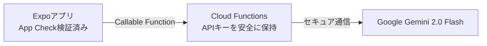

バイブコーディングでアプリを作れるようになった次のステップとして、**「アプリそのものの中にAIを組み込む」**ことに挑戦してみましょう。

Googleの最先端モデルである **Gemini API** を活用すれば、ユーザーの利用履歴に合わせたパーソナライズされた励ましメッセージの生成、習慣改善のアドバイス、写真からの自動テキスト解析など、アプリの価値を何倍にも引き上げるインテリジェント機能を驚くほど簡単に実装できます。

この記事では、Gemini APIをExpoモバイルアプリに安全に組み込む手法、構造化データ（JSON）を確実に受け取る手法、そして不正利用を防ぐセキュリティ対策までを詳しく解説します。

---

## この記事のサブコンテンツ

1. [モバイルアプリに生成AIを組み込むメリットと活用アイデア](#1-モバイルアプリに生成aiを組み込むメリットと活用アイデア)
2. [Geminiモデルの選択（Gemini 2.0 Flashの圧倒的優位性）](#2-geminiモデルの選択gemini-20-flashの圧倒的優位性)
3. [最重要：モバイルアプリにおけるAPIキー保護とApp Check](#3-最重要モバイルアプリにおけるapiキー保護とapp-check)
4. [Cloud Functionsを中継したセキュアなBFFアーキテクチャ](#4-cloud-functionsを中継したセキュアなbffアーキテクチャ)
5. [Structured Outputs（JSON出力保証）による確実なアプリ連携](#5-structured-outputsjson出力保証による確実なアプリ連携)
6. [実践：今日の達成記録から「パーソナライズ激励」を生成する](#6-実践今日の達成記録からパーソナライズ激励を生成する)
7. [まとめと次のステップ](#7-まとめと次のステップ)

---

## 1. モバイルアプリに生成AIを組み込むメリットと活用アイデア

これまでのアプリは、あらかじめ用意された定型文を表示するだけでした。

しかし、生成AIを組み合わせることで、**「自分だけの専属パーソナルコーチ」**のような温かみのある体験を提供できます。

### 活用アイデア
- **習慣管理**: 連続達成記録を見て「田中さん、今週5日連続の読書達成ですね！素晴らしい粘り強さです」と具体的に褒めてくれる。
- **挫折時のアドバイス**: 3日連続で未達成のとき、「目標のハードルを少し下げて、1ページだけ読むところから再開してみませんか？」と優しく寄り添う。
- **マルチモーダル解析**: 食べた料理や読んだ本をカメラで撮るだけで、自動的にタイトルやカロリーを推定して記録する。

---

## 2. Geminiモデルの選択（Gemini 2.0 Flashの圧倒的優位性）

モバイルアプリのインライン機能には、以下の特性を持つモデルが最適です。

| モデル | 応答速度 | コスト | 最適なユースケース |
| :--- | :--- | :--- | :--- |
| **Gemini 2.0 Flash / 1.5 Flash** | **爆速（1秒以内）** | **極めて安価（無料枠も大）** | **日常的なアドバイス、要約、チャット（推奨）** |
| **Gemini 1.5 Pro** | やや重い | 中程度 | 複雑な長文分析、高度な推論を要する専門機能 |

ユーザーを待たせないスマホのUIには、圧倒的に高速でレスポンスが返る **Gemini Flash** 系が一択です。

---

## 3. 最重要：モバイルアプリにおけるAPIキー保護とApp Check

> [!CAUTION]
> **絶対に、クライアントアプリのソースコード（`process.env.EXPO_PUBLIC_GEMINI_API_KEY` 等）に生のAPIキーをハードコードしてはいけません！**

モバイルアプリのバイナリは、知識のある第三者によって簡単に逆コンパイル・解析されます。生のAPIキーが流出すると、知らないうちに数万回リクエストが送られ、高額な請求が発生する恐れがあります。

### セキュリティの二重防壁
1. **BFF（Backend-for-Frontend）中継**: Cloud Functions などのサーバー側にのみAPIキーを保管し、アプリは認証トークン経由でサーバーを叩く。
2. **Firebase App Check**: AppleのDeviceCheck / App Attest や AndroidのPlay Integrity API と連携し、「正規のアプリから送信されたリクエストであること」を暗号学的に証明。悪意あるスクレイピングツールを入口で遮断します。

---

## 4. Cloud Functionsを中継したセキュアなBFFアーキテクチャ

Firebase Cloud Functions側に、Geminiを呼び出すエンドポイントを定義します。



```typescript
// functions/src/index.ts
import { onCall, HttpsError } from 'firebase-functions/v2/https';
import { GoogleGenAI } from '@google/genai';

const ai = new GoogleGenAI({ apiKey: process.env.GEMINI_API_KEY });

export const generateCoachAdvice = onCall(async (request) => {
  // 認証チェック
  if (!request.auth) {
    throw new HttpsError('unauthenticated', 'ログインが必要です。');
  }

  const { habits } = request.data;

  const prompt = `あなたは温かく前向きなパーソナル習慣コーチです。
以下の習慣データをもとに、ユーザーへの励ましメッセージを作成してください。
データ: ${JSON.stringify(habits)}`;

  const response = await ai.models.generateContent({
    model: 'gemini-2.0-flash',
    contents: prompt,
    config: {
      responseMimeType: 'application/json',
    },
  });

  return JSON.parse(response.text || '{}');
});
```

---

## 5. Structured Outputs（JSON出力保証）による確実なアプリ連携

アプリのUIでAIの出力を扱う場合、「通常の文章」ではなく**厳密なJSON構造（Structured Outputs）**で返してもらうことで、表示崩れやパースエラーを完全に防ぐことができます。

```json
{
  "score": 85,
  "headline": "今週も素晴らしいペースです！",
  "advice": "夜遅くの読書は睡眠を妨げる可能性があるため、入浴前の15分にシフトしてみるのがおすすめです。",
  "cheerEmoji": "🎉"
}
```

このJSONをそのままUIの各パーツ（スコアバッジ、見出し、本文カード）にバインドして表示します。

---

## 6. 実践：今日の達成記録から「パーソナライズ激励」を生成する

アプリ側（Expo）からこの関数を呼び出し、完了チェック時のモーダルやバナーにAIの言葉を表示します。

```typescript
import { getFunctions, httpsCallable } from 'firebase/functions';

export async function fetchDailyAdvice(habits: any[]) {
  const functions = getFunctions();
  const generateCoach = httpsCallable(functions, 'generateCoachAdvice');

  try {
    const result: any = await generateCoach({ habits });
    return result.data;
  } catch (error) {
    // オフラインやエラー時は定型文にフォールバック
    return {
      score: 100,
      headline: '一歩ずつの継続が力になります！',
      advice: '今日も自分のペースで小さな達成を積み重ねていきましょう。',
      cheerEmoji: '💪',
    };
  }
}
```

「AIが自分の毎日の頑張りを見てくれている」という感覚が、アプリへの愛着と継続率を決定づけます。

---

## 7. まとめと次のステップ

生成AI（Gemini API）のインテリジェントな力を取り入れたことで、他にはない唯一無二の魅力的なプロダクトへと進化しました。

次の記事では、こうしたプレミアムなAI機能や高度な機能を武器に、継続的な収益を生み出す「サブスクリプション課金（RevenueCat）」を実装する「[04. ストア決済とサブスクリプションを実装する](../04/)」に進みましょう。
