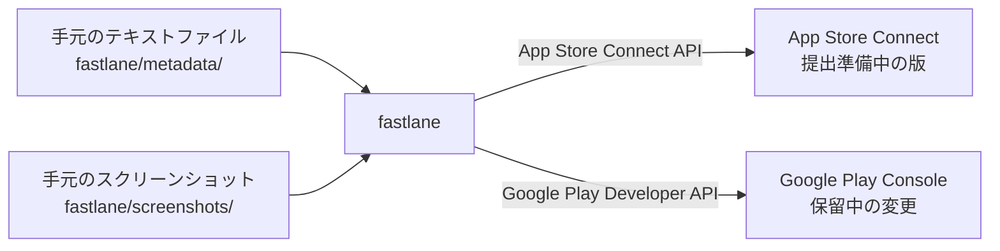
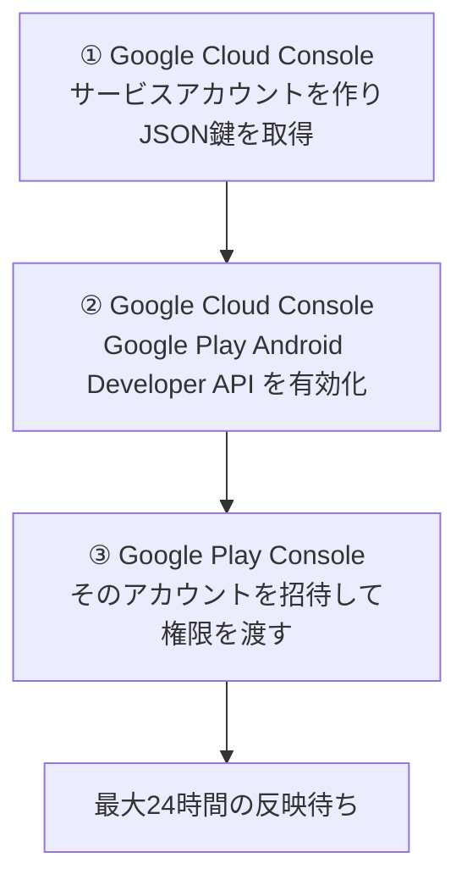

応用事項編（PhaseEx）の最終章へようこそ。

アプリを一度リリースすると、そこから先は「**直す → ビルドする → ストアの掲載情報を更新する**」の繰り返しになります。このうち最後の「掲載情報の更新」だけが、いつまでも手作業として残りがちです。

アプリ名、サブタイトル、キーワード、説明文、リリースノート、そしてスクリーンショット。これを**2つのストア × 対応言語の数**だけ、ブラウザで管理画面を開いて貼り直す。バージョンを上げるたびにこれをやるのは、地味ですが確実に消耗します。しかも手で貼る作業は、**貼り忘れと貼り間違いが必ず起きます。**

幸い、AppleもGoogleも公式のAPIを用意しています。この記事では、**App Store Connect API** と **Google Play Developer API** の鍵を取得し、**fastlane** を経由して掲載情報の反映をコマンド一発にするまでを、実際に詰まった箇所も含めて手順として解説します。

---

## この記事のサブコンテンツ

1. [手作業のストア更新を卒業する](#1-手作業のストア更新を卒業する)
2. [Apple側でApp Store Connect APIキーを発行する](#2-apple側でapp-store-connect-apiキーを発行する)
3. [Google側でサービスアカウントを作り権限を渡す](#3-google側でサービスアカウントを作り権限を渡す)
4. [fastlaneを導入して掲載情報をファイルで管理する](#4-fastlaneを導入して掲載情報をファイルで管理する)
5. [審査に出さないことを二重に担保して実行する](#5-審査に出さないことを二重に担保して実行する)
6. [実際に踏んだ落とし穴と応用事項編の総まとめ](#6-実際に踏んだ落とし穴と応用事項編の総まとめ)

---

## 1. 手作業のストア更新を卒業する

### 何が自動化できて、何ができないのか

最初にここをはっきりさせておきます。**APIで触れる範囲は、あなたが思うより狭いです。**

| | APIから更新できる |
| :--- | :--- |
| **できる** | アプリ名、サブタイトル、キーワード、説明文、簡単な説明、宣伝用テキスト、リリースノート、審査メモ、スクリーンショット、フィーチャーグラフィック |
| **できない（管理画面で設定するもの）** | 価格、販売地域、年齢レーティング、データセーフティ／Appのプライバシー、輸出コンプライアンス |
| **できない（意図的にやらせないもの）** | **審査への提出** |

3つ目が重要です。fastlaneは審査提出まで実行できてしまいますが、**この記事では最後まで「提出しない」設定で組みます**。提出は人間が管理画面から判断して押す作業として残します。自動化の目的は、**ボタンを押す人を消すことではなく、貼り間違いを消すこと**だからです。

### 全体像



掲載文を**リポジトリの中のテキストファイル**として持ち、それをfastlaneがAPIに流し込む形です。こうすると掲載文がGitの履歴に残り、「前回なんて書いたっけ」を管理画面で探す必要がなくなります。

### なぜ生のAPIではなくfastlaneなのか

テキストを送るだけなら、APIを直接叩くコードをAIに書かせても大した手間ではありません。**問題はスクリーンショットです。**

App Store Connect APIの画像アップロードは、「**枠の予約 → チャンク分割送信 → チェックサム照合 → コミット**」という多段プロトコルになっています。1枚ごとにこれを正しく踏む必要があり、自前で書くと最も消耗する部分です。iPhoneとAndroid、複数言語分を揃えると数十枚になるので、ここを自分で実装する価値はほぼありません。

fastlaneの `deliver`（iOS）と `supply`（Android）は、まさにこの部分を解決するために存在します。

### そして、CIには載せません

CI/CDの流れからすると意外に思われるかもしれませんが、**この経路はGitHub Actionsではなく、自分のマシンから実行することを勧めます**。理由は3つあります。

1. **スクリーンショットの元データがCIに存在しない。** 画像は容量が大きいのでリポジトリに入れないのが普通で、`.gitignore` に入っていればCIのチェックアウト先には1枚もありません。そもそもスクショの撮影はアプリを実際に動かす作業なので、**パイプラインの起点が最初から手元にあります。**
2. **鍵の置き場所が1つ減る。** 秘密鍵はストアへの書き込み権限そのものです。手元の `~/.config/` にパーミッション600で置いて使うなら、GitHub Secretsに複製する必要がありません。**鍵が存在する場所が少ないほど、漏れる経路も少なくなります。**
3. **見慣れない環境からの自動アクセスは、余計な検知を招きやすい。** 特にfastlaneをApple IDとパスワードでログインさせる古い方式では、CIのIPアドレスから叩くたびに2要素認証のチャレンジが飛び、セッションが切れてジョブが止まります。これから作るAPIキー方式ならその多くは回避できますが、**普段使っているマシンから叩いている限り、そもそもこの問題は起きません。**

文言だけを更新する軽い経路をCIに置くのは可能ですし、後述の設定でも動きます。ただし**最初の一歩は必ずローカルから**にしてください。何が起きているかが見える状態で始めた方が、圧倒的に安全です。

---

## 2. Apple側でApp Store Connect APIキーを発行する

Apple側でやることは1つだけです。**APIキーの発行**です。

### 発行の場所

**App Store Connect → ユーザーとアクセス → 統合 → App Store Connect API**

### 初回は「許可のリクエスト」画面が出ます

はじめてこのページを開くと、「**App Store Connect APIへのアクセスには許可が必要です**」という画面が表示されます。これは異常ではなく、正常な初回ゲートです。そのままリクエストしてください。

- **個人アカウントの場合**: 有効化はアカウント責任者（＝あなた自身）の操作なので、その場で通ります。
- **組織アカウントで責任者が別の人の場合**: その人の承認待ちになります。

有効化されると、**「チームキー」タブ**が現れます。ここでキーを生成します。

### アクセス権は「App Manager」を選ぶ

キー生成時にアクセス権（ロール）を聞かれます。掲載情報の更新には **App Manager** で足ります。Adminを選ぶ必要はありません。

### 控えるものは3つ

| | 何か | どこに出るか |
| :--- | :--- | :--- |
| **Issuer ID** | チーム全体で共通のUUID | ページ上部 |
| **Key ID** | 発行したキーごとの10文字前後の英数字 | キーの行 |
| **`.p8` ファイル** | 秘密鍵の本体 | 発行直後にダウンロード |

:::danger[`.p8` は一度しかダウンロードできません]
`.p8` ファイルは**発行直後にその場で一度だけ**ダウンロードできます。画面を閉じてしまうと二度と取得できず、キーを取り消して作り直すことになります。

ダウンロードしたら、**リポジトリの外**に保管してください。`~/.config/myapp/` の下などが適当です。**Gitには絶対に入れません。**

```bash
mkdir -p ~/.config/myapp
mv ~/Downloads/AuthKey_XXXXXXXXXX.p8 ~/.config/myapp/
chmod 600 ~/.config/myapp/AuthKey_XXXXXXXXXX.p8
```
:::

### 先に知っておくべき前提が1つ

`deliver` が更新するのは、App Store Connectの「**編集可能な状態にあるバージョン**」の掲載文です。具体的には「提出準備中（Prepare for Submission）」の版を指します。

**この版が存在しないと、`deliver` はそこで止まります**。まだ次のバージョンを作っていない場合は、先にApp Store Connectで新しいバージョンを追加しておいてください。

---

## 3. Google側でサービスアカウントを作り権限を渡す

ここが一番手数が多く、一番詰まりやすい手順です。**Google Cloud ConsoleとGoogle Play Consoleという別々の管理画面をまたぐ**うえ、片方を忘れると次で解説するとおり**紛らわしいエラー**が出ます。

やることは3つです。



### ① サービスアカウントを作り、JSON鍵を取得する

**Google Cloud Console → IAMと管理 → サービスアカウント → サービスアカウントを作成**

1. 名前を付けます（例: `play-store-publisher`）。
2. **Cloud側のロールは付けなくて構いません**。権限はこの後Play Console側で渡します。
3. 作成後、そのアカウントの「キー」タブから **鍵を追加 → 新しい鍵を作成 → JSON** を選び、ダウンロードします。
4. 表示される**メールアドレス**（`…@….iam.gserviceaccount.com` の形）を控えます。次の手順で使います。

JSONも `.p8` と同じ扱いです。リポジトリの外に置いてください。

```bash
mv ~/Downloads/xxxxx-xxxxxxxxxxxx.json ~/.config/myapp/play-publisher.json
chmod 600 ~/.config/myapp/play-publisher.json
```

:::caution[既存のサービスアカウントを使い回さないでください]
Firebase AnalyticsやGA4のために作ったサービスアカウントを招待すれば、技術的には動きます。**それでも分けてください。**

| | 分析用の鍵 | Play用の鍵 |
| :--- | :--- | :--- |
| できること | データの読み取り | **リリースの公開、ストア掲載の編集** |
| 漏れた場合 | データを見られる（復旧可能） | **ユーザーにビルドを配信されうる** |

共用すると、その鍵1つで分析の管理まで触れることになります。加えて、片方を失効させるともう片方も止まるので、ローテーションが連動してしまいます。作成自体は数分の作業なので、分ける方が安いです。
:::

### ② Google Play Android Developer API を有効化する

**ここが最大の落とし穴です。**

**Google Cloud Console → APIとサービス → ライブラリ → 「Google Play Android Developer API」を検索 → 有効にする**

サービスアカウントに権限を渡すことと、**そのアカウントが属するCloudプロジェクトでAPI自体を使えるようにすること**は、まったく別の設定です。有効化を忘れると、権限が正しく付いていても次のようなエラーが返ります。

```text
Google Play Android Developer API has not been used in
project 000000000000 before or it is disabled.
```

厄介なのは、**これが権限の反映待ちとまったく同じ `403` として返る**ことです。「権限を付けたのに動かない、まだ反映されていないんだろう」と待ち続けても、永久に直りません。**Play連携で `403` を見たら、まずここを疑ってください。**

### ③ Play Consoleで招待し、権限を最小限だけ渡す

**Google Play Console → ユーザーとアクセス → ユーザーを招待**

先ほど控えたサービスアカウントのメールアドレスを入力します。そして権限の設定で、**「アプリの権限」タブから対象アプリだけを追加**し、**「アカウントの権限」は空のまま**にしてください。こうすると、この鍵が届く範囲がそのアプリ1つに閉じます。

アプリに対して渡す権限は、次のとおりです。

| 権限 | 付与 | 理由 |
| :--- | :---: | :--- |
| **製品版としてのリリース** | **✗ 渡さない** | ユーザーに公開できてしまう |
| テスト版トラックとしてのアプリのリリース | ✓ 渡す | Edits APIに必要。製品版には公開できない |
| **ストアの掲載情報の編集**（別グループ） | ✓ 渡す | 掲載文と素材の更新に必要 |
| アプリ情報の閲覧 | ✓ ONのまま | `supply` は書き込む前に現在の状態を読んで差分を組み立てるため、読み取りが無いと**書き込みも失敗します** |
| テスト版トラックの管理、テスターリストの編集 | ✗ 渡さない | テスターリストは扱わない |

:::tip[設定で止めるより、権限で止める]
このあと設定ファイルにも「審査に出さない」オプションを書きますが、**設定は編集ミスや将来の変更で消えます。**

一方、**「製品版としてのリリース」を渡さなければ、鍵そのものに公開する能力がありません**。設定を書き間違えても、鍵が漏れても、fastlaneが暴走しても、製品版には届きません。Play Consoleの説明文にも「この権限で、ユーザーはGoogle Playで製品版としてアプリを公開することはできません」と明記されています。

**二重に止めるうちの、外側の一本がこれです。**
:::

### ④ 反映を待つ

権限がAPIから見えるようになるまで、**最大24時間**かかります。付与直後に叩くと権限エラーになりますが、待てば直ります。

**この手順は他の作業より先に着手しておくのが得です**。待ち時間が他の作業と重なるので、最後に回すとそこだけで丸1日止まります。

:::note[前提: 一度は手動でアップロードしていること]
Google Play Developer APIは、**そのアプリで一度もConsoleからAAB/APKをアップロードしていない状態では使えません**。すでに一度でもリリース（内部テストを含む）していれば、この条件は満たしています。
:::

---

## 4. fastlaneを導入して掲載情報をファイルで管理する

鍵が揃ったので、fastlaneを入れます。

### インストール

fastlaneはRuby製なので、`Gemfile` でバージョンを固定して入れるのが確実です。プロジェクトのルートに置きます。

```ruby
# Gemfile
source "https://rubygems.org"
gem "fastlane"
```

```bash
bundle install
```

:::note
`bundle install` は**ストアに一切触れません**。ツールを手元に入れるだけの操作なので、この時点では何も起きません。
:::

### 識別子を書く

`fastlane/Appfile` に、両ストアの識別子を書きます。Expoなら `app.json` の `expo.ios.bundleIdentifier` と `expo.android.package` と同じ値です。

```ruby
# fastlane/Appfile
app_identifier("com.example.myapp")   # iOS
package_name("com.example.myapp")     # Android
```

### 掲載文をファイルとして置く

fastlaneは**決まった場所のテキストファイルを読んで**ストアに送ります。ディレクトリ構造そのものが設定ファイルです。

```text
fastlane/
├── Appfile
├── Fastfile
├── metadata/                        # ← iOS
│   ├── ja/
│   │   ├── name.txt                 # アプリ名
│   │   ├── subtitle.txt             # サブタイトル
│   │   ├── keywords.txt             # キーワード
│   │   ├── description.txt          # 説明
│   │   ├── promotional_text.txt     # 宣伝用テキスト
│   │   └── release_notes.txt        # このバージョンの新機能
│   ├── en-US/
│   │   └── （同じ構成）
│   ├── review_information/
│   │   └── notes.txt                # 審査メモ
│   └── android/                     # ← Android
│       ├── ja-JP/
│       │   ├── title.txt            # アプリ名
│       │   ├── short_description.txt  # 簡単な説明
│       │   ├── full_description.txt   # 詳しい説明
│       │   ├── changelogs/
│       │   │   └── 63.txt           # versionCode ごとのリリースノート
│       │   └── images/
│       │       └── phoneScreenshots/
│       └── en-US/
│           └── （同じ構成）
└── screenshots/                     # ← iOS
    ├── ja/
    └── en-US/
```

ここで**2つ、間違えやすい点**があります。

**ロケール名が両ストアで違います。** iOSは `ja` ／ `en-US`、Playは `ja-JP` ／ `en-US` です。日本語のディレクトリ名が食い違うので、コピーするときに事故が起きます。

**スクリーンショットの掲載順は、ファイル名の辞書順で決まります。** `deliver` も `supply` も名前順に並べるだけなので、意図した順序にしたければ**先頭に番号を振ってください。**

```text
ja__iphone-6.5__1-home.png
ja__iphone-6.5__2-record.png
ja__iphone-6.5__3-result.png
```

### 掲載文の生成をAIに任せる

[Phase06：04. ストア掲載情報とスクリーンショットをAIで作成する](../../publish/04/) で固めたアプリの仕様をもとに、AIエージェントに掲載文を**この構造のまま書き出させる**ことができます。

```text
【タスク: ストア掲載テキストをfastlaneの構造で生成】

ルートの `SPEC.md` を読み込んでください。
App Store と Google Play の掲載テキストを作成し、以下のパスにファイルとして書き出してください。

- fastlane/metadata/ja/name.txt              （30文字以内）
- fastlane/metadata/ja/subtitle.txt          （30文字以内）
- fastlane/metadata/ja/keywords.txt          （100文字以内、半角コンマ区切り、スペースなし）
- fastlane/metadata/ja/description.txt       （4,000文字以内）
- fastlane/metadata/ja/release_notes.txt
- fastlane/metadata/android/ja-JP/title.txt              （30文字以内）
- fastlane/metadata/android/ja-JP/short_description.txt  （80文字以内）
- fastlane/metadata/android/ja-JP/full_description.txt   （4,000文字以内）

同じ内容の英語版を en-US / en-US にも作成してください。
各ファイルは本文のみで、見出しやコードフェンスを含めないこと。
書き出したあと、各ファイルの文字数と上限を表にして報告してください。
```

最後の1行が効きます。**文字数の上限超過はアップロード時にエラーになる**ので、送る前に手元で分かる方が早いです。特に英語は同じ内容でも日本語の倍以上の文字数になるため、**先に詰まるのはたいてい英語側です。**

---

## 5. 審査に出さないことを二重に担保して実行する

### Fastfile を書く

`fastlane/Fastfile` に、iOSとAndroidそれぞれのレーンを定義します。**コメントの部分が実際に効いている理由**なので、消さずに残しておくことをおすすめします。

```ruby
# fastlane/Fastfile

opt_out_usage
default_platform(:ios)

# スクリーンショットは直列に上げる。既定の並列アップロードは削除と競合し、
# 同じ画像が2枚ずつ入った状態を作る。掲載順はファイル名順で決まるので、
# 重複はそのまま並び順の崩れになる。
# レーンの中で設定しても遅い ―― deliver の設定はその前に組まれる。
ENV["DELIVER_NUMBER_OF_THREADS"] ||= "1"

platform :ios do
  desc "App Store Connect の掲載情報を更新する（審査には出さない）"
  lane :metadata do |options|
    with_screenshots = options.fetch(:screenshots, false)

    key = app_store_connect_api_key(
      key_id: ENV.fetch("ASC_KEY_ID"),
      issuer_id: ENV.fetch("ASC_ISSUER_ID"),
      key_content: ENV.fetch("ASC_KEY_P8"),
      is_key_content_base64: true
    )

    deliver(
      api_key: key,
      # 文言と素材だけ。ビルドはここでは扱わない。
      skip_binary_upload: true,
      skip_app_version_update: true,
      # 提出しない。「提出準備中」の版に置かれるだけで、公開はされない。
      submit_for_review: false,
      automatic_release: false,
      # 確認プロンプトと HTML プレビューを出さない。
      force: true,
      run_precheck_before_submit: false,
      # 素材を持たずに overwrite すると、ストア側の既存素材が消える。
      # 持っているときだけ上書きし、持っていないときは触らない。
      skip_screenshots: !with_screenshots,
      overwrite_screenshots: with_screenshots
    )
  end
end

platform :android do
  desc "Google Play の掲載情報を更新する（審査には送らない）"
  lane :metadata do |options|
    with_screenshots = options.fetch(:screenshots, false)

    supply(
      json_key_data: ENV.fetch("PLAY_SERVICE_ACCOUNT_JSON"),
      # リリースノートはトラック別。既定の production を使うと、そこに存在しない
      # versionCode のノートを書こうとして落ちるうえ、サービスアカウントに
      # 製品版の権限も渡していない。
      track: "internal",
      # ビルドは上げない。掲載文と素材だけ。
      skip_upload_apk: true,
      skip_upload_aab: true,
      # ビルドを伴わないので、changelog がどの版のものか supply 自身では
      # 判断できない。changelogs/<code>.txt のファイル名と一致させる。
      version_code: android_version_code,
      # 保存はするが審査に送らない。これがないと掲載変更がそのまま審査に行く。
      changes_not_sent_for_review: true,
      skip_upload_images: !with_screenshots,
      skip_upload_screenshots: !with_screenshots
    )
  end
end

# app.json の expo.android.versionCode を読む。
# changelogs/<code>.txt のファイル名と揃えるために必要。
def android_version_code
  require "json"
  config = JSON.parse(File.read(File.expand_path("../app.json", __dir__), encoding: "UTF-8"))
  code = config.dig("expo", "android", "versionCode")
  UI.user_error!("app.json から versionCode を読めませんでした。") if code.nil?
  code.to_s
end
```

:::caution[Playの掲載情報は、トラック別ではありません]
`track: "internal"` と書いてあるので「内部テスト用の掲載文が更新される」と読めてしまいますが、**違います。**

Google Playにおいて、**ストアの掲載文はトラックに紐づきません**。内部テスト専用の説明文というものは存在せず、更新されるのは**本番の掲載情報そのもの**です。トラックの指定が効くのは**リリースノート（changelogs）だけ**です。

公開を止めているのは `changes_not_sent_for_review: true` の方で、これは「保存はするが審査には送らない」という意味です。変更はPlay Consoleに**保留中の変更**として溜まり、あなたが管理画面から「審査に送信」を押すまで公開されません。

なお、**この「審査に送信」という操作はAPIから実行する方法が用意されておらず、Consoleの画面上でしかできません**。これは制約ではなく、むしろ最後の安全弁です。
:::

### 鍵を読み込んで実行するスクリプト

環境変数を毎回手で用意するのは事故のもとなので、薄いシェルスクリプトにまとめます。

```bash
#!/usr/bin/env bash
# tools/store_upload.sh {ios|android}
#
# 資格情報は ~/.config/myapp/ に置く。リポジトリには入れない。
#   AuthKey_XXXXXXXXXX.p8   … App Store Connect の秘密鍵
#   play-publisher.json     … Play のサービスアカウント
#   asc.env                 … ASC_KEY_ID と ASC_ISSUER_ID

set -euo pipefail

# fastlane はロケールが UTF-8 でないと警告を出す。掲載文が日本語なので
# 文字化けの実害がありうる。ここで明示する。
export LANG="${LANG:-en_US.UTF-8}"
export LC_ALL="${LC_ALL:-en_US.UTF-8}"

# 並列アップロードは削除と競合して画像が重複する。
export DELIVER_NUMBER_OF_THREADS="${DELIVER_NUMBER_OF_THREADS:-1}"

PLATFORM="${1:-}"
if [[ "$PLATFORM" != "ios" && "$PLATFORM" != "android" ]]; then
  echo "使い方: tools/store_upload.sh {ios|android}" >&2
  exit 2
fi

ROOT="$(cd "$(dirname "${BASH_SOURCE[0]}")/.." && pwd)"
CONF="$HOME/.config/myapp"

if [[ "$PLATFORM" == "ios" ]]; then
  source "$CONF/asc.env"
  : "${ASC_KEY_ID:?asc.env に ASC_KEY_ID がありません}"
  : "${ASC_ISSUER_ID:?asc.env に ASC_ISSUER_ID がありません}"

  KEY_FILE="$CONF/AuthKey_${ASC_KEY_ID}.p8"
  [[ -f "$KEY_FILE" ]] || { echo "$KEY_FILE がありません。" >&2; exit 1; }

  # .p8 は改行を含むので base64 にして渡す。
  ASC_KEY_P8="$(base64 < "$KEY_FILE" | tr -d '\n')"
  export ASC_KEY_ID ASC_ISSUER_ID ASC_KEY_P8
else
  KEY_JSON="$CONF/play-publisher.json"
  [[ -f "$KEY_JSON" ]] || { echo "$KEY_JSON がありません。" >&2; exit 1; }
  PLAY_SERVICE_ACCOUNT_JSON="$(cat "$KEY_JSON")"
  export PLAY_SERVICE_ACCOUNT_JSON
fi

cd "$ROOT"
# 手元には素材が揃っているので、スクリーンショットも一緒に送る。
bundle exec fastlane "$PLATFORM" metadata screenshots:true
```

`~/.config/myapp/asc.env` は次の2行だけのファイルです。

```bash
ASC_KEY_ID=XXXXXXXXXX
ASC_ISSUER_ID=xxxxxxxx-xxxx-xxxx-xxxx-xxxxxxxxxxxx
```

### 実行する

```bash
chmod +x tools/store_upload.sh
tools/store_upload.sh ios
```

**必ずiOSから始めてください**。理由は影響範囲の違いです。

| 操作 | ストアへの影響 |
| :--- | :--- |
| `bundle install` | **なし**。ツールを手元に入れるだけ |
| `store_upload.sh ios` | 「提出準備中」の版の文言と素材が置き換わる。**提出はされない。何度でも上書きできる** |
| `store_upload.sh android` | **本番の掲載情報**に保留中の変更が溜まる。審査には送られない |

iOSは提出しない限り何も公開されず、失敗しても跡が残りません。**練習台として圧倒的に安全です**。ここでfastlaneが実際に動くことを確かめてから、Play側に広げてください。

### 提出しないことは、二重に担保されています

| | 何が止めているか |
| :--- | :--- |
| **設定** | `submit_for_review: false` / `changes_not_sent_for_review: true` |
| **権限** | サービスアカウントに「製品版としてのリリース」を渡していない |

設定は編集ミスで消えることがあります。権限は消えません。**両方あって初めて「絶対に公開されない」と言えます。**

---

## 6. 実際に踏んだ落とし穴と応用事項編の総まとめ

この仕組みを実際に組んだときに詰まった箇所を、そのまま並べておきます。**どれも設定を書いた時点では分からず、走らせて初めて出るもの**です。

| 症状 | 原因と対処 |
| :--- | :--- |
| **Playで `403` が返り続ける** | Cloudプロジェクトで `androidpublisher.googleapis.com` が未有効。**権限の反映待ちと同じ `403` に見える**ので、まずAPIの有効化を確認する |
| **同じスクリーンショットが2枚ずつ入る** | `deliver` の並列アップロードが削除処理と競合する。`DELIVER_NUMBER_OF_THREADS=1` を**Fastfileの冒頭かシェル側**で設定する（レーンの中では遅い） |
| **`Cannot find changelog because no version code given`** | ビルドを伴わないメタデータ単独更新では、`supply` はどのversionCode宛てか判断できない。`version_code:` を明示する |
| **通ったはずのファイルが見つからない** | `supply` と自前の存在確認とで相対パスの基準が違う。**パスは絶対パスに統一する** |
| **日本語の掲載文が化ける、`invalid byte sequence`** | ロケールがUTF-8でない。`LANG` / `LC_ALL` を明示する |
| **ストア側の既存スクショが消えた** | 素材を持たない状態で `overwrite_screenshots` を有効にした。**素材があるときだけ上書きする**設定にする |
| **`deliver` が「バージョンがない」で止まる** | App Store Connect側に編集可能な版がない。先に新しいバージョンを作る |
| **空の掲載文がストアに送られた** | 生成前に走らせた。**掲載文が空だと事故が一番高くつく**ので、ファイルが無ければ止めるガードを入れておく |

最後の1つは特に重要です。fastlaneは、**「掲載文が空」を有効な指示として受け取ります**。説明文が空欄になったままストアに反映される事故を防ぐため、レーンの先頭でファイルの存在を確認して止めるようにしておいてください。

### 掲載文と実装の食い違いに気をつける

もう1つ、仕組みの外側の話をしておきます。

**掲載文は実装より先に古くなります**。たとえば課金を実装したのに説明文が「アプリ内課金はありません」のままだと、それは単なる古い文章ではなく、**メタデータ不一致としてリジェクトの理由になります**。特に審査メモに書いた内容とビルドの実態がずれていると、審査で必ず止まります。

自動化するとアップロード自体は一瞬で終わるので、**送る前に差分を確認する習慣**が、手作業の頃より重要になります。

### 応用事項編の総まとめ

これで応用事項編（PhaseEx）の全ステップが完了しました。

1. **クラウド連携**: [01. Firebaseでユーザー認証とクラウド保存を実装する](../01/) で、端末を超えたデータ同期を実現しました。
2. **リテンション**: [02. Push通知を実装してアクティブ率を向上させる](../02/) で、ユーザーが戻ってくる仕掛けを作りました。
3. **AI機能**: [03. AI機能（Gemini API）をアプリに組み込む](../03/) で、アプリ自身にインテリジェンスを持たせました。
4. **計測**: [04. GA4でアプリの使われ方を計測する](../04/) で、次に直すべきものを数字で決められるようにしました。
5. **運用基盤**: [05. ストア掲載情報の更新をAPIで自動化する](../05/)（この記事）で、リリースのたびに発生する手作業を仕組みに置き換えました。

### 次のフェーズ：セキュリティ編へ

ここまでで、あなたのアプリは認証を持ち、クラウドにユーザーのデータを預かり、課金まで扱うようになりました。そしてこの記事で、**ストアへの書き込み権限を持つ鍵**まで手元に増えました。

つまり、**守るべきものが増えた**ということです。

この記事では鍵の置き場所と権限の絞り方に触れましたが、それはアプリ全体から見ればごく一部です。最後の「PhaseSec：セキュリティ編」では、AIが書いたコードをそのまま公開することのリスク、秘密情報の扱い、そしてデータベースの権限設計を点検します。

さっそく「[01. AI生成コードをそのまま公開して大丈夫？](../../security/01/)」へ進みましょう！
