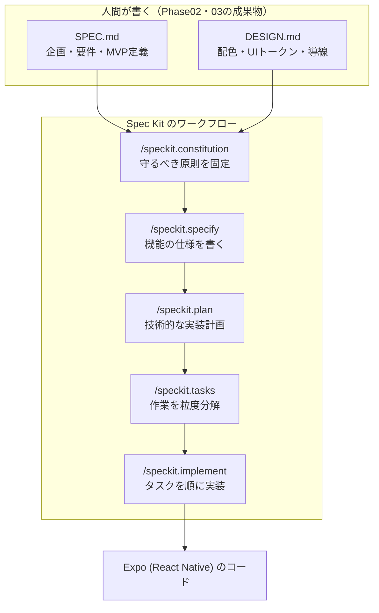

リサーチ編（Phase02）で作成した「アプリ企画書（`SPEC.md`）」と、リデザイン編（Phase03）で作成した「デザイン仕様書（`DESIGN.md`）」。これら2つの強力な設計図が手元に揃いました。

いよいよここから、アプリを実際にコードに落とし込む「**Phase04：コーディング編**」が始まります。

従来の開発では、人間がエディタを開いて1行ずつコードを打ち込んでいました。しかしバイブコーディングでは、**GitHubが公開している「Spec Kit」に設計図を読み込ませ、仕様 → 計画 → タスク → 実装という決まった順序でAIエージェントに手を動かさせます**。

この記事では、Spec Kit のCLIをインストールし、Expoプロジェクトに導入して、あなたの `SPEC.md` と `DESIGN.md` をSpec Kitのワークフローに接続するまでを解説します。

---

## この記事のサブコンテンツ

1. [仕様駆動開発（Spec-Driven Development）とGitHub Spec Kit](#1-仕様駆動開発spec-driven-developmentとgithub-spec-kit)
2. [なぜSpec Kitを使うとコード生成の精度が劇的に上がるのか](#2-なぜspec-kitを使うとコード生成の精度が劇的に上がるのか)
3. [uv と specify CLI のインストール](#3-uv-と-specify-cli-のインストール)
4. [プロジェクトフォルダの初期化とSpec Kitの導入](#4-プロジェクトフォルダの初期化とspec-kitの導入)
5. [Spec Kitが生成するディレクトリ構成を理解する](#5-spec-kitが生成するディレクトリ構成を理解する)
6. [/speckit.constitution でプロジェクトの「憲法」を作る](#6-speckitconstitution-でプロジェクトの憲法を作る)
7. [開発環境セットアップのチェックリスト](#7-開発環境セットアップのチェックリスト)
8. [まとめと次のステップ](#8-まとめと次のステップ)

---

## 1. 仕様駆動開発（Spec-Driven Development）とGitHub Spec Kit

### Spec Kit は「作法」ではなく、実際に動くツールです

**GitHub Spec Kit** は、GitHubが公開しているオープンソースのツールキットです（[github/spec-kit](https://github.com/github/spec-kit)）。`specify` というCLIをインストールし、プロジェクトに対して実行すると、AIエージェント用のスラッシュコマンド一式と、仕様を置くためのディレクトリ構造がセットアップされます。

Spec Kitが掲げる考え方が **仕様駆動開発（Spec-Driven Development / SDD）** です。ひとことで言えば、「**作る前に、何を作るのかを書き切る**」というだけの話です。

AIにいきなり「習慣管理アプリを作って」と指示すると、AIは一般的なコードを思いつきで出力し、ファイル構成が破綻したり、画面ごとにデザインがバラバラになったりします。

Spec Kitは、この流れを次の決まった順序に固定します。



重要なのは、**`/speckit.implement` にたどり着くまでにAIがコードを書き始めないこと**です。仕様・計画・タスクがファイルとしてリポジトリに残るため、途中で会話が途切れても、AIはそのファイルを読み直すだけで文脈を完全に取り戻せます。

---

## 2. なぜSpec Kitを使うとコード生成の精度が劇的に上がるのか

AIエージェントとの協業において最大の敵は、「**コンテキストの忘却（Context Drift）**」と「**勝手な機能肥大化（Feature Creep）**」です。

| 開発の課題 | 指示なしのバイブコーディング | Spec Kitを使ったバイブコーディング |
| :--- | :--- | :--- |
| **機能スコープ** | 勝手に認証や複雑なクラウド連携を作り始める | `spec.md` に書かれていない機能はタスクに現れないので実装されない |
| **デザインの一貫性** | 画面ごとにボタンの角丸や青色が微妙に異なる | 憲法（constitution）に書いた `DESIGN.md` 遵守が全タスクに効く |
| **アーキテクチャ** | 1ファイルに何千行も書き散らす | `plan.md` でディレクトリ構成を先に決めてから実装に入る |
| **再開性・文脈維持** | 会話が長くなると前提を忘れて迷走する | `specs/` 配下のファイルを読み直させるだけで即座に文脈を復元できる |
| **進捗の可視化** | どこまで終わったか本人にも分からない | `tasks.md` のチェックボックスがそのまま進捗表になる |

### 人間とAIの役割分担の明確化
- **人間の役割**: `SPEC.md` で「何を作るか（スコープ）」を決め、`DESIGN.md` で「どう見せるか（体験）」を定義し、Spec Kitが出した計画をレビューし、出来上がった実機を触って品質をジャッジする。
- **AIの役割**: 承認された仕様と計画に忠実に従い、React Nativeの構文、TypeScriptの型定義、StyleSheetのコードを高速に書き出す。

---

## 3. uv と specify CLI のインストール

`specify` CLIはPython製で、Pythonのパッケージ管理ツール **uv** 経由で導入します。

### 手順1：uv をインストールする

Macなら Homebrew が最も手軽です。

```bash
brew install uv
```

Homebrewを使わない場合は、公式のインストーラーでも導入できます。

```bash
curl -LsSf https://astral.sh/uv/install.sh | sh
```

### 手順2：specify CLI をインストールする

```bash
uv tool install specify-cli
```

インストールが終わったら、必要なツールが揃っているかを `specify` 自身に点検させます。

```bash
specify self check
```

:::tip[毎回インストールしたくない場合]
`uvx` を使えば、インストールせずに一度だけ実行することもできます。まず試してみたいときはこちらが手軽です。

```bash
uvx --from git+https://github.com/github/spec-kit.git specify init --here
```
:::

---

## 4. プロジェクトフォルダの初期化とSpec Kitの導入

### 手順1：プロジェクトディレクトリの作成

ターミナルを開き、新しいアプリ用のディレクトリを作成してGitリポジトリを初期化します（ここではサンプルとして習慣管理アプリ `habit-flow` とします）。

```bash
mkdir habit-flow
cd habit-flow
git init
```

### 手順2：設計ドキュメントを配置する

前のフェーズで完成させた2つの仕様書を、プロジェクトルート直下に置きます。

```text
habit-flow/
├── SPEC.md        # [Phase02-05] で作成したアプリ企画書
└── DESIGN.md      # [Phase03-05] で作成したデザイン仕様書
```

### 手順3：Spec Kit を導入する

`specify init` を、いま作ったディレクトリに対して実行します。`--here` が「新しいフォルダを作らず、今いるディレクトリに入れる」という意味です。

```bash
specify init --here --integration claude
```

`--integration` には、あなたが使うAIエージェントを指定します。使える値の一覧は次のコマンドで確認できます。

```bash
specify integration list
```

Claude Code なら `claude`、GitHub Copilot なら `copilot` のように指定します。指定したエージェント向けのスラッシュコマンド定義（Claude Code なら `.claude/commands/` 配下）が生成され、その日から `/speckit.specify` などが使えるようになります。

:::caution[すでにファイルがあるディレクトリに入れるとき]
`SPEC.md` などを先に置いた状態だと、空でないディレクトリへの初期化を確認されます。意図どおりなら `--force` を付けてください。

```bash
specify init --here --force --integration claude
```
:::

---

## 5. Spec Kitが生成するディレクトリ構成を理解する

初期化が終わると、プロジェクトは次のようになります。

```text
habit-flow/
├── .specify/             # Spec Kit の本体
│   ├── memory/           # プロジェクトの憲法（constitution）が置かれる場所
│   ├── templates/        # spec / plan / tasks のひな形
│   └── scripts/          # スラッシュコマンドが内部で使うスクリプト
├── .claude/              # 指定したエージェント用のスラッシュコマンド定義
│   └── commands/
├── specs/                # 機能ごとの仕様がここに積み上がっていく
├── SPEC.md               # [Phase02] アプリ企画書（人間が書いた原典）
└── DESIGN.md             # [Phase03] デザイン仕様書（人間が書いた原典）
```

ここで押さえるべきは、**`SPEC.md` / `DESIGN.md` と `specs/` は役割が違う**という点です。

| ファイル | 誰が書くか | 何が書いてあるか |
| :--- | :--- | :--- |
| `SPEC.md` | 人間（Phase02） | プロダクト全体の企画・ペルソナ・MVPスコープ・やらないこと |
| `DESIGN.md` | 人間（Phase03） | 配色トークン・タイポグラフィ・コンポーネント規約・画面構成 |
| `.specify/memory/constitution.md` | AI（あなたが承認） | 上の2つから抽出した、全機能に効く「絶対に守る原則」 |
| `specs/001-.../spec.md` | AI（あなたが承認） | **1つの機能**の要件。実装するたびに増えていく |
| `specs/001-.../plan.md` | AI（あなたが承認） | その機能をどう実装するかの技術的な計画 |
| `specs/001-.../tasks.md` | AI（あなたが承認） | 実装を細かく分解した作業リスト |

`SPEC.md` と `DESIGN.md` は**プロダクトの原典**として残り続け、`specs/` には**機能単位の作業記録**が積み上がっていきます。

---

## 6. /speckit.constitution でプロジェクトの「憲法」を作る

Spec Kitで最初に実行するコマンドが `/speckit.constitution` です。これは、この先すべての機能開発に効く「絶対に守る原則」を決める作業です。

AIエージェント（Antigravity IDE、Claude Code、Cursorなど）のチャット欄で、次のように入力します。

```text
/speckit.constitution

プロジェクトルートの `SPEC.md` と `DESIGN.md` を読み込み、そこから
このプロジェクトの憲法（constitution）を作成してください。

### 憲法に必ず含めてほしい原則
1. スコープ厳守：`SPEC.md` の「今回は実装しない機能 (Out of Scope)」に
   挙がっている機能（認証、クラウド同期、プッシュ通知など）は、
   ユーザーからの明示的な指示がない限り絶対に実装しないこと。
2. デザイン遵守：スタイリングは必ず `DESIGN.md` のカラートークンと
   スペーシングを使い、独自のカラーコードをハードコードしないこと。
3. 技術スタック固定：Expo (React Native) + TypeScript、
   ルーティングは Expo Router、保存は AsyncStorage、
   スタイリングは StyleSheet.create（CSSライブラリは追加しない）。
4. 型安全：すべての props と関数引数に型注釈を付け、`any` を使わないこと。
5. 責務分離：UIは `components/`、データ操作は `hooks/` に置き、
   画面ファイルにビジネスロジックを直接書かないこと。
```

実行すると、`.specify/memory/constitution.md` が生成されます。**中身は必ず自分で読んでください。** ここに書かれた内容が、以降のすべての `/speckit.plan` と `/speckit.implement` に効きます。ここが緩いと、後段で何度も同じ注意をする羽目になります。

### CLAUDE.md との関係

Phase03 までで作った `CLAUDE.md`（またはIDEのRules）は、引き続き**エージェント全体の作法**を書く場所として使います。役割が重複しないよう、次のように整理しておくと迷いません。

```markdown
# Project Guidelines: HabitFlow

## Workflow
- 機能追加は必ず Spec Kit の順序（/speckit.specify → /speckit.plan →
  /speckit.tasks → /speckit.implement）で進めること。
  仕様と計画の承認を飛ばして実装を始めないこと。
- プロダクトの要件は `SPEC.md`、デザインは `DESIGN.md`、
  守るべき原則は `.specify/memory/constitution.md` を参照すること。

## Communication
- 変更を行う前に、対象ファイルと影響範囲を簡潔に報告すること。
- 判断に迷ったら、勝手に決めずに質問すること。
```

---

## 7. 開発環境セットアップのチェックリスト

次のステップへ進む前に、以下の項目がすべて完了しているか確認してください。

- [ ] `uv` がインストールされている（`uv --version` で確認）
- [ ] `specify` CLI がインストールされている（`specify self check` が通る）
- [ ] アプリ用の作業ディレクトリが作成され、Gitが初期化されている
- [ ] ルート直下に `SPEC.md` と `DESIGN.md` が配置されている
- [ ] `specify init --here` を実行し、`.specify/` と `specs/` が生成されている
- [ ] お使いのエージェントで `/speckit.` と打つとコマンド候補が出る
- [ ] `/speckit.constitution` を実行し、`.specify/memory/constitution.md` の中身を自分で読んで承認した

---

## 8. まとめと次のステップ

この記事では、仕様駆動開発の実体である GitHub Spec Kit を実際にインストールし、`SPEC.md` と `DESIGN.md` を憲法という形でワークフローに接続しました。設計書をコードと同じリポジトリに置き、AIの行動範囲を先に固定したことで、迷走しない開発体制が整いました。

次の記事では、実際に Expo のプロジェクトを新規作成し、スマートフォン実機で初期画面を表示する「[02. Expoプロジェクトを作成して実機で起動する](../02/)」に進みましょう。
