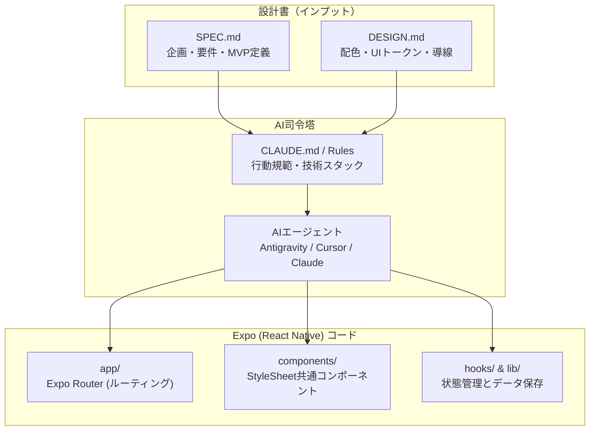

リサーチ編（Phase02）で作成した「アプリ企画書（`SPEC.md`）」と、リデザイン編（Phase03）で作成した「デザイン仕様書（`DESIGN.md`）」。これら2つの強力な設計図が手元に揃いました。

いよいよここから、アプリを実際にコードに落とし込む**「Phase04：コーディング編」**が始まります。

従来の開発では、人間がエディタを開いて1行ずつコードを打ち込んでいました。しかしバイブコーディングでは、**「GitHub Spec Kit」やAIエージェントに仕様書を読み込ませ、最初のコード生成や機能実装をリードさせます**。

この記事では、AIが迷わずブレずに高品質なコードを生成するための司令塔として「Spec Kit」の環境をセットアップする手順を詳しく解説します。

---

## この記事のサブコンテンツ

1. [バイブコーディングの司令塔「GitHub Spec Kit」とは何か](#1-バイブコーディングの司令塔github-spec-kitとは何か)
2. [なぜSpec Kitを使うとコード生成の精度が劇的に上がるのか](#2-なぜspec-kitを使うとコード生成の精度が劇的に上がるのか)
3. [プロジェクトフォルダの初期化と設計書の配置](#3-プロジェクトフォルダの初期化と設計書の配置)
4. [AIエージェントへの司令塔ルール（CLAUDE.md / Rules）を設定する](#4-aiエージェントへの司令塔ルールclaudemd--rulesを設定する)
5. [Antigravity IDE / Cursor でのSpec Kit読み込み確認](#5-antigravity-ide--cursor-でのspec-kit読み込み確認)
6. [開発環境セットアップのチェックリスト](#6-開発環境セットアップのチェックリスト)
7. [まとめと次のステップ](#7-まとめと次のステップ)

---

## 1. バイブコーディングの司令塔「GitHub Spec Kit」とは何か

### 仕様駆動開発（Spec-Driven Development）の実現

**GitHub Spec Kit** とは、リポジトリ内に仕様書（Spec）、デザイン規約（Design）、実装タスク（Tasks）を構造化して保持し、AIエージェント（Antigravity IDE、Claude Code、Cursorなど）に「今何をすべきか」を厳密に指示するためのフレームワーク・作法です。

AIにいきなり「習慣管理アプリを作って」と指示すると、AIは一般的なコードを思いつきで出力し、ファイル構成が破綻したり、画面ごとにデザインがバラバラになったりします。

Spec Kitの作法を取り入れることで、AIは次のように動きます。



すべての生成コードが `SPEC.md` と `DESIGN.md` の制約を満たすよう強制されるため、手戻りやデバッグの無限ループが最小限に抑えられます。

---

## 2. なぜSpec Kitを使うとコード生成の精度が劇的に上がるのか

AIエージェントとの協業において最大の敵は、**「コンテキストの忘却（Context Drift）」**と**「勝手な機能肥大化（Feature Creep）」**です。

| 開発の課題 | 指示なしのバイブコーディング | Spec Kitを使ったバイブコーディング |
| :--- | :--- | :--- |
| **機能スコープ** | 勝手に認証や複雑なクラウド連携を作り始める | `SPEC.md` の「Out of Scope」を認識し、MVP3機能だけに集中する |
| **デザインの一貫性** | 画面ごとにボタンの角丸や青色が微妙に異なる | `DESIGN.md` のカラートークンやStyleSheet規約を厳密に継承する |
| **アーキテクチャ** | 1ファイルに何千行も書き散らす | Expo Routerの推奨ディレクトリ構成に従ってコンポーネントを分割する |
| **再開性・文脈維持** | 会話が長くなると前提を忘れて迷走する | リポジトリ内のSpecファイルを再読させるだけで即座に文脈を完全復元できる |

### 人間とAIの役割分担の明確化
- **人間の役割**: `SPEC.md` で「何を作るか（スコープ）」を決め、`DESIGN.md` で「どう見せるか（体験）」を定義し、出来上がった実機を触って品質をジャッジする。
- **AIの役割**: 設計書に忠実に従い、React Nativeの構文、TypeScriptの型定義、StyleSheetのコードを高速に書き出す。

---

## 3. プロジェクトフォルダの初期化と設計書の配置

それでは、実際に開発用ディレクトリを準備し、リサーチ編・リデザイン編の成果物を配置しましょう。

### 手順1：プロジェクトディレクトリの作成

ターミナルを開き、新しいアプリ用のディレクトリを作成してGitリポジトリを初期化します（ここではサンプルとして習慣管理アプリ `habit-flow` とします）。

```bash
# 作業ディレクトリの作成
mkdir habit-flow
cd habit-flow

# Gitの初期化
git init
```

### 手順2：設計ドキュメントの配置

プロジェクトルート直下に、前のフェーズで完成させた2つの仕様書を配置します。

```text
habit-flow/
├── SPEC.md        # [Phase02-05] で作成したアプリ企画書
├── DESIGN.md      # [Phase03-05] で作成したデザイン仕様書
└── CLAUDE.md      # AIエージェントへの行動規範（次節で作成）
```

- **`SPEC.md`**: アプリの目的、ペルソナ、MVPで実装する3大機能（登録・トグル・ローカル保存）、今回は作らない機能（Out of Scope）。
- **`DESIGN.md`**: 配色パレット（Primary, Background, Surface, Text）、フォントサイズ、余白トークン、共通UIコンポーネントの仕様。

---

## 4. AIエージェントへの司令塔ルール（CLAUDE.md / Rules）を設定する

AIエージェントがコードを生成する際、毎回手動で「DESIGN.mdを見てね」と指示するのは非効率です。

Antigravity IDE や Claude Code、Cursor などの現代的なAIツールには、プロジェクトルートに置かれた設定ファイルを自動的にシステムプロンプトとして読み込む機能があります。

プロジェクトルートに **`CLAUDE.md`**（または `.cursorrules` やエージェントルール）を作成し、以下の内容を記述します。

```markdown
# Project Guidelines: HabitFlow

## Core Principle: Spec-Driven Development
- 実装を開始する前に、必ずルートの `SPEC.md` と `DESIGN.md` を読み込み、その内容を遵守すること。
- `SPEC.md` の「今回は実装しない機能 (Out of Scope)」に指定された機能（認証、クラウド同期など）は、ユーザーから明示的な指示がない限り絶対に実装しないこと。
- スタイリングを行う際は、必ず `DESIGN.md` に記載されたカラーコード（トークン）とスペーシングを使用し、独自のハードコードを行わないこと。

## Technical Stack
- Framework: Expo SDK (React Native) + TypeScript
- Routing: Expo Router (File-based routing under app/)
- Storage: @react-native-async-storage/async-storage
- Styling: StyleSheet.create (No third-party CSS library unless requested)
- Icons: @expo/vector-icons (Ionicons / Feather)

## Coding & Architectural Conventions
1. コンポーネントは `components/` ディレクトリに小さく再利用可能な単位で作成すること。
2. 画面ロジック（データの取得・更新）はカスタムフック（`hooks/`）に抽出し、UIと責務を分離すること。
3. すべてのプロパティや関数引数にTypeScriptの型注釈をつけ、`any` を使用しないこと。
4. 変更を行う前に、対象ファイルと影響範囲をユーザーに簡潔に報告すること。
```

---

## 5. Antigravity IDE / Cursor でのSpec Kit読み込み確認

ルールファイルを作成したら、AIエージェントが正しくルールを認識しているかテストします。

エディタのチャット欄（またはターミナルエージェント）に以下の簡単な質問を投げかけてみてください。

```text
このプロジェクトの目的と、今回絶対に実装してはいけない機能を教えてください。
```

AIエージェントが以下のように回答すれば、Spec Kitの読み込みは大成功です。

> **AIの回答例**:
> 「本プロジェクト『HabitFlow』は、1タップで今日の目標進捗を記録できるミニマリスト習慣トラッカーです。ルートの `SPEC.md` に従い、初期MVPでは**『ユーザー認証・ログイン機能』『クラウドデータベース連携』『プッシュ通知』は絶対に実装しません（Out of Scope）**。ローカルストレージ（AsyncStorage）のみで完結させます。」

このように、AIエージェント自身が自分の行動制約を理解した状態を作ることで、暴走の危険はゼロになります。

---

## 6. 開発環境セットアップのチェックリスト

次のステップへ進む前に、以下の項目がすべて完了しているか確認してください。

- [ ] アプリ用の作業ディレクトリが作成され、Gitが初期化されている（`git status` で確認）
- [ ] ルート直下に `SPEC.md` が配置されている
- [ ] ルート直下に `DESIGN.md` が配置されている
- [ ] ルート直下にエージェント制御用の `CLAUDE.md`（Rules）が配置されている
- [ ] AIエージェントに質問し、設計書のスコープを正しく認識していることをテストした
- [ ] Antigravity IDE や Cursor でプロジェクトフォルダを開いている

---

## 7. まとめと次のステップ

この記事では、仕様駆動開発（Spec-Driven Development）の要となる Spec Kit のベース環境を整えました。設計書をコードと同じリポジトリに配置し、AIエージェントの行動規範をルール化することで、迷走しない開発体制が整いました。

次の記事では、実際に Expo のプロジェクトを新規作成し、スマートフォン実機で初期画面を表示する「[02. Expoプロジェクトを作成して実機で起動する](../02/)」に進みましょう。
