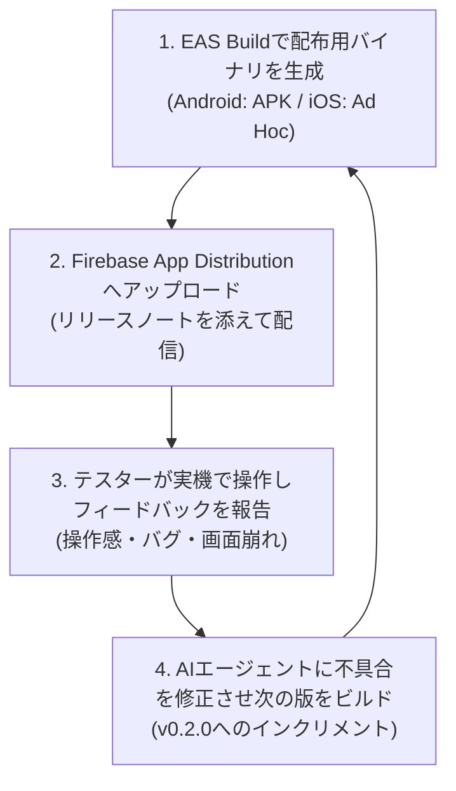

コーディング編（Phase04）で、あなたのスマートフォン上で動く最初のMVP（実用最小限のアプリ）が完成しました。

「すぐにでもApp StoreやGoogle Playに公開したい！」と思うかもしれません。しかし、自分の端末だけでしか動かしていないアプリをそのままストア審査に出すのは、極めてリスクが高い行動です。

開発者自身の端末では完璧に見えても、**別の画面サイズのスマホ、異なるOSバージョン、あるいはアプリの仕様を知らない他人が触った瞬間に、想定外のエラーや操作の迷子が発生するから**です。

この記事では、ストアの事前審査なしで迅速にテスターへアプリを配信できる「Firebase App Distribution」を活用したテスト配布の全体像と運用フローを詳しく解説します。

---

## この記事のサブコンテンツ

1. [なぜストア公開前に第三者テストが必要なのか（開発者の盲点）](#1-なぜストア公開前に第三者テストが必要なのか開発者の盲点)
2. [テスト配布手法の徹底比較（TestFlight / Google Play内部テスト vs Firebase）](#2-テスト配布手法の徹底比較testflight--google-play内部テスト-vs-firebase)
3. [Firebase App Distributionが個人開発・バイブコーディングに最適な理由](#3-firebase-app-distributionが個人開発バイブコーディングに最適な理由)
4. [テスター側のユーザー体験（招待メールから起動まで）](#4-テスター側のユーザー体験招待メールから起動まで)
5. [テスト配布運用の4ステップサイクル](#5-テスト配布運用の4ステップサイクル)
6. [配布開始に必要な前提環境とアカウントチェックリスト](#6-配布開始に必要な前提環境とアカウントチェックリスト)
7. [まとめと次のステップ](#7-まとめと次のステップ)

---

## 1. なぜストア公開前に第三者テストが必要なのか（開発者の盲点）

アプリ開発において、作者本人は「どこをタップすればどう動くか」を完全に知っているため、無意識に正常な操作手順だけをなぞってしまいます。これを「開発者バイアス」と呼びます。

しかし、実際の一般ユーザーは以下のような行動をとります。

- 文字入力フォームに絵文字、記号、極端な長文を一気に入力してレイアウトを崩す
- 通信中やローディング中にボタンを高速で連打し、二重送信エラーを引き起こす
- 機内モードや電波の悪い地下鉄でアプリを開き、画面が固まる
- 極小画面（iPhone SE等）や極端に縦長なAndroidで文字がはみ出て読めなくなる
- 画面を開いた瞬間「次に何をタップすればいいのか」が分からず、3秒でアプリを閉じてしまう

こうした問題点を正式リリース前に洗い出し、AIエージェントと一緒にサクッと潰しておくことこそが、ストア公開後の低評価レビュー（★1〜★2）を防ぎ、好意的な初期レビューを獲得する唯一の防壁となります。

---

## 2. テスト配布手法の徹底比較（TestFlight / Google Play内部テスト vs Firebase）

モバイルアプリのテスト配布にはいくつかの方法があります。それぞれの特徴と制約を整理してみましょう。

| プラットフォーム | 対象OS | ストア審査の有無 | 配布スピード | メリット | デメリット |
| :--- | :--- | :--- | :--- | :--- | :--- |
| **Apple TestFlight** | iOS のみ | 外部テスター配信時は**Appleの審査が必要**（初回は数時間〜1日） | やや遅い | 本番と同じ環境でテスト可能。最大10,000人 | Android非対応。審査待ちの手間がある |
| **Google Play 内部テスト** | Android のみ | 基本審査なし | 普通（10分〜数時間） | Playストアの決済や更新フローを検証可能 | Google Playアカウント連携が必須。招待がやや煩雑 |
| **Firebase App Distribution** | **iOS / Android 両対応** | **一切なし（完全フリー）** | **爆速（ビルド完了後即座）** | **審査なし・1つのダッシュボードで両OS一元管理** | iOSの場合、テスターの端末登録（UDID）が必要 |

バイブコーディングの最大の武器は「素早い改善ループ（Agile Iteration）」です。ビルドができた瞬間にすぐ友だちやチームの端末へ飛ばせる **Firebase App Distribution** は、開発初期〜中期のプロトタイプ検証に最も適した選択肢です。

---

## 3. Firebase App Distributionが個人開発・バイブコーディングに最適な理由

個人開発者や少人数チームがFirebase App Distributionを採用する主なメリットは次の3点です。

1. **ストア審査待ちがゼロ**: ビルドが完成した瞬間にテスターの手元へ届くため、1日に何回でも新しい修正パッチを配布できます。
2. **クロスプラットフォームの一元管理**: iOS（IPA / Ad Hoc）とAndroid（APK）を同じFirebaseダッシュボード上で一括管理・分析できます。
3. **テスターの手間が最小限**: テスターは招待メールから数タップするだけで、専用アプリ（App Tester）経由で手軽にインストール・アップデートを受け取れます。

---

## 4. テスター側のユーザー体験（招待メールから起動まで）

テスター側にどのような案内が届くのかを理解しておくと、スムーズな案内が可能です。

1. **招待メールの受信**: 開発者がテスターを招待すると、Google/Firebaseから「〇〇アプリのテストに招待されました」というメールが届きます。
2. **App Testerのインストール**: 案内リンクをタップすると、テスター専用の管理ツール「Google App Tester」のインストール画面が開きます。
3. **アプリのワンタップインストール**: App Tester内であなたのアプリ（例: `HabitFlow v0.1.0`）が表示され、「ダウンロード」を押すだけでスマホのホーム画面にアプリアイコンが追加されます。

---

## 5. テスト配布運用の4ステップサイクル

フィードバック編（Phase05）では、以下の4つのステップを繰り返し回していきます。

このサイクルを2〜3周回すだけで、アプリの堅牢性と使いやすさは見違えるほど向上します。

---

## 6. 配布開始に必要な前提環境とアカウントチェックリスト

テスト配布を始めるために、以下の準備を行います（まだ持っていないものは次のステップで順次用意します）。

- [ ] **Expoアカウント & EAS CLI**: クラウド上でスタンドアロンアプリをビルドするために必要です（Phase01で準備済み）。
- [ ] **Googleアカウント**: Firebaseプロジェクトを作成するために必須です。
- [ ] **Firebaseプロジェクト**: アプリの配布管理を行う無料のプロジェクトを作成します。
- [ ] **テスター候補のリスト**: 家族、親しい友人、共同開発者など、初期の2〜5人をリストアップしておきます。
- [ ] **テスターの端末情報（iOSの場合）**: iOSアプリを外部配布する場合、端末の「UDID」の登録が必要になります（EASが自動化を支援してくれます）。

---

## 7. まとめと次のステップ

手元だけで開発を完結させず、早い段階でテスターに触ってもらうことが、愛されるアプリを作る最大のショートカットです。

次の記事では、テスターの端末に直接インストールできるスタンドアロンバイナリ（AndroidのAPK / iOSのAd Hocビルド）を、EAS Buildを使ってクラウド上で作成する「[02. EAS Buildでテスター配布用ビルドを作る](../02/)」に進みましょう。
