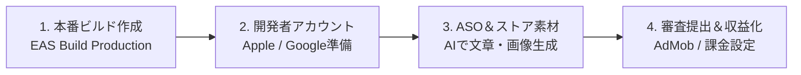

フィードバック編（Phase05）を通じて、アプリの完成度と安定性は飛躍的に高まりました。

いよいよここから、あなたの作品を全世界のユーザーの手元へ届ける「**Phase06：公開＆マネタイズ編**」がスタートします。

スマートフォンのホーム画面に自分の作ったアプリが並び、ストア検索で見つかり、ダウンロードされ、収益が発生する体験は、個人開発者にとって最大の醍醐味です。

この記事では、App StoreおよびGoogle Playへの正式リリースまでのロードマップ、個人開発に適した収益モデルの選び方、そしてストア審査で絶対に知っておくべき必須知識を詳しく解説します。

---

## この記事のサブコンテンツ

1. [ストア公開までの全体タイムラインと4つのマイルストーン](#1-ストア公開までの全体タイムラインと4つのマイルストーン)
2. [個人開発アプリの収益化モデル3類型（広告・サブスク・買い切り）](#2-個人開発アプリの収益化モデル3類型広告サブスク買い切り)
3. [AppleとGoogleのストア手数料体系と「小規模事業者プログラム」](#3-appleとgoogleのストア手数料体系と小規模事業者プログラム)
4. [App StoreとGoogle Playの審査カルチャーの違い](#4-app-storeとgoogle-playの審査カルチャーの違い)
5. [初心者が直面しやすい「リジェクト三大原因」の事前回避策](#5-初心者が直面しやすいリジェクト三大原因の事前回避策)
6. [公開＆マネタイズ編の学習ロードマップ](#6-公開マネタイズ編の学習ロードマップ)
7. [まとめと次のステップ](#7-まとめと次のステップ)

---

## 1. ストア公開までの全体タイムラインと4つのマイルストーン

アプリをストアに並べるまでには、以下の4つのマイルストーンを進めていきます。

1. **本番ビルドの生成**: 配布用（APK/Ad Hoc）とは異なり、各ストアの提出形式（Androidは `.aab`、iOSは本番署名済み `.ipa`）でビルドします。
2. **アカウントと法規の準備**: 開発者登録、プライバシーポリシーURLの整備を行います（個人名義で登録する場合、DUNS番号は不要です。必要になるのは法人・組織名義で申請するときだけです）。
3. **ストア掲載情報（ASO）の準備**: アプリのアイコン、スクリーンショット、魅力的な紹介文を用意します。
4. **審査提出とリリース**: ストアの厳格な審査をクリアし、公開ボタンを押します。

---

## 2. 個人開発アプリの収益化モデル3類型（広告・サブスク・買い切り）

アプリでお金を生み出す仕組みには、大きく分けて3つの選択肢があります。

| 収益モデル | 代表的な実装 | メリット | デメリット | 収益性の目安 | おすすめのアプリ分野 |
| :--- | :--- | :--- | :--- | :--- | :--- |
| **広告モデル** | Google AdMob（バナー・リワード） | 導入が最も容易。ユーザーの利用ハードルが低い | まとまったPV（利用頻度）が必要 | 1,000impあたり数百円〜 | ツール系、ゲーム系、日々の記録系 |
| **サブスクリプション（定期購読）** | RevenueCat（In-App Purchase） | 継続的なストック収入になる。LTVが高い | 継続して課金したくなるプレミアム価値が必要 | 月額300円〜1,000円/人 | 習慣管理、学習、AI支援、専門機能 |
| **買い切り（単発購入 / 広告削除）** | RevenueCat | 「数百円で広告を消したい」層に刺さりやすい | 1ユーザーあたり1回しか収益化できない | 300円〜800円/回 | ユーティリティ、計算機、メモ帳 |

初期のMVPアプリでは、「**基本機能は無料 + 画面下部にAdMobバナー**」、または「**300円で広告非表示になる買い切り**」から始めるのが最も現実的で成功率が高い戦略です。

---

## 3. AppleとGoogleのストア手数料体系と「小規模事業者プログラム」

アプリ内課金や有料アプリの販売を行う場合、プラットフォーム側の手数料を把握しておく必要があります。

- **標準手数料**: 売上の **30%** がストア手数料として差し引かれます。
- **App Store Small Business Program（Apple）**:
  - 前年の売上が100万ドル（約1億5,000万円）未満の個人開発者や中小企業は、**自分で申請する**ことで手数料が **15%** に下がります。申請しないと30%のままなので、アカウントを作成したら必ず初期段階で手続きしておきましょう。
  - 参照：[App Store Small Business Program](https://developer.apple.com/app-store/small-business-program/)
- **Google Play の 15% 区分**:
  - Google Playは申請不要で、**各年の売上のうち最初の100万ドルまでが自動的に15%**、それを超えた分が30%になります。定期購読（サブスクリプション）は売上額にかかわらず初日から15%です。

---

## 4. App StoreとGoogle Playの審査カルチャーの違い

両者のストア審査には明確な特徴の違いがあります。

- **Apple App Store**:
  - 人間のレビュアーが実際にアプリを端末で操作してチェックします。
  - デザインの洗練度、バグの有無、プライバシー規約の正確性、クラッシュしないかを厳しく見られます。
  - 審査期間は通常24時間〜48時間程度です。
- **Google Play**:
  - 自動スキャンによるセキュリティ・マルウェア・ポリシー違反の検査が中心です。
  - 2023年11月13日以降に作成された個人アカウントの場合、「**12人以上のテスターによる14日間連続のクローズドテスト**」を完了することが公開の必須条件となっています（後述の記事で攻略法を解説）。

---

## 5. 初心者が直面しやすい「リジェクト三大原因」の事前回避策

審査で落ちる（リジェクトされる）理由の約8割は、以下の3つに集約されます。

1. **クラッシュ・リンク切れ（Guideline 2.1）**: 存在しない画面への遷移や、ボタンを押しても反応しない状態。
2. **コンテンツ不足・単なるWebサイトのラッパー（Guideline 4.2 Minimum Functionality）**: 「Webサイトを表示しているだけでアプリである必然性がない」と判断されるケース。ネイティブならではの操作感やオフライン動作が鍵になります。
3. **プライバシーポリシーの不備（Guideline 5.1）**: 個人情報やデータ収集に関するポリシーURLが未記載、またはアクセスできない状態。

本ガイドのステップを踏んでいけば、これらを事前にすべてクリアした状態で提出できます。

---

## 6. 公開＆マネタイズ編の学習ロードマップ

公開＆マネタイズ編（Phase06）では、以下のステップで進めていきます。

- **[02. EAS Buildで本番リリース用ビルドを作る](../02/)**: ストア提出用の本番バイナリ（AAB/IPA）をクラウドで作成。
- **[03. Apple Developer & Google Play Consoleの準備をする](../03/)**: 登録手順と必須設定を攻略。
- **[04. ストア掲載情報とスクリーンショットをAIで作成する](../04/)**: ASO対策と美麗なモックアップ画像のAI生成。
- **[05. 広告と課金を実装し、審査を通してリリースする](../05/)**: 広告と課金を実装し、審査をクリアして祝・公開へ！

---

## 7. まとめと次のステップ

アプリを世界に羽ばたかせるための青写真が見えてきました。

次の記事では、App Store ConnectやGoogle Play Consoleに直接アップロード可能な「本番リリース用バイナリ」を、EAS Buildでクラウド生成する「[02. EAS Buildで本番リリース用ビルドを作る](../02/)」に進みましょう。
