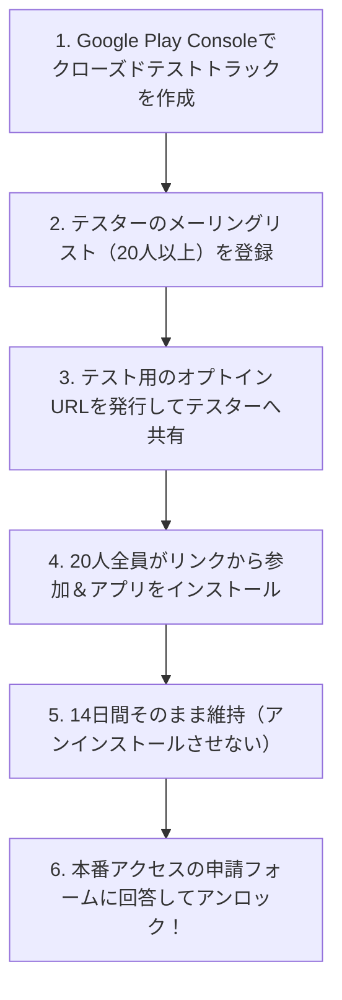

本番ビルドができても、それを受け入れる「ストアの開発者アカウント」がなければ世界中にアプリを届けることはできません。

このステップでは、**Apple Developer Program** と **Google Play Console** の登録手順、審査で必須となる法規関連（プライバシーポリシー等）の準備、そして個人開発者が最も頭を悩ませる「Google Playの20人テスター要件」の攻略法までを詳しく解説します。

---

## この記事のサブコンテンツ

1. [開発者アカウントの料金・必要書類・基本比較](#1-開発者アカウントの料金必要書類基本比較)
2. [Apple Developer Programの登録とApp Store Connectの初期設定](#2-apple-developer-programの登録とapp-store-connectの初期設定)
3. [Google Play Consoleの登録と本人確認（KYC）](#3-google-play-consoleの登録と本人確認kyc)
4. [Google Play「20人×14日間のクローズドテスト」完全攻略ロードマップ](#4-google-play20人14日間のクローズドテスト完全攻略ロードマップ)
5. [審査通過に必須となるプライバシーポリシーの完全テンプレート](#5-審査通過に必須となるプライバシーポリシーの完全テンプレート)
6. [まとめと次のステップ](#6-まとめと次のステップ)

---

## 1. 開発者アカウントの料金・必要書類・基本比較

| 項目 | Apple Developer Program | Google Play Console |
| :--- | :--- | :--- |
| **費用** | 年間 99米ドル（約15,000円/年ごとの自動更新） | 初回 25米ドル（買い切り・永久） |
| **本人確認** | Apple IDの2要素認証、クレジットカード | パスポートまたは運転免許証による厳格なKYC |
| **アカウント区分** | 個人名義（本名がストアに表示）または組織（DUNS番号要） | 個人名義（本名と住所が一部公開）または組織 |
| **承認までの日数** | 通常24時間〜数日 | 本人確認の審査に2〜5営業日 |

---

## 2. Apple Developer Programの登録とApp Store Connectの初期設定

### 登録手順
1. iPhoneの「Apple Developer」アプリをダウンロードして申請するのが最もスムーズです（Apple IDの生体認証と本人確認が端末上で完結するため）。
2. 年間契約（99ドル）をApple Payまたはクレジットカードで支払います。
3. 承認完了後、Webブラウザで **[App Store Connect](https://appstoreconnect.apple.com/)** にログインします。

### App Store Connectでの新規アプリ作成
- **マイApp** → **「＋（新規App）」** をクリック。
- **プラットフォーム**: iOS にチェック。
- **名前**: アプリ名（例: `HabitFlow`）
- **プライマリ言語**: 日本語
- **バンドルID**: `app.json` で指定した識別子（`com.yourname.habitflow`）を選択。
- **SKU**: 管理用の任意のユニーク文字列（例: `habitflow-001`）

---

## 3. Google Play Consoleの登録と本人確認（KYC）

### 登録手順
1. **[Google Play Console](https://play.google.com/console/)** にアクセスし、Googleアカウントでログインします。
2. アカウントタイプとして「個人」または「組織」を選択し、初回登録料（25ドル）を支払います。
3. 運転免許証やパスポートの鮮明な写真をアップロードし、本人確認（Identity Verification）を申請します（通常1〜3日で承認されます）。
4. クレジットカードまたはデビットカードの明細住所と、登録住所が完全に一致していることを確認してください。

---

## 4. Google Play「20人×14日間のクローズドテスト」完全攻略ロードマップ

2023年11月以降に作成された個人のGoogle Playアカウントでは、**「本番公開を申請する前に、最低20人のテスターがオプトインした状態で14日間連続でクローズドテストを実施する」**という必須要件が課されています。

個人開発者にとって最大の壁と言われますが、以下の手順で計画的に進めれば確実にクリアできます。



### テスターを集める具体的なアクション
- **開発者コミュニティやX（旧Twitter）の相互協力**: 「#GooglePlay20人テスター」などのハッシュタグで、お互いにアプリをインストールし合うコミュニティが活発に機能しています。
- **職場・家族・友人への直接依頼**: リアルな知人にお願いするのが最も確実です。
- **Phase05のテスター網の転用**: Firebase App Distributionで協力してくれたテスターに、Google Play内部テストへの参加を依頼します。

---

## 5. 審査通過に必須となるプライバシーポリシーの完全テンプレート

両ストア共通で、**「公開されているプライバシーポリシーページのURL」**の入力が法的に義務付けられています。

以下のテンプレートをコピーし、アプリ名や連絡先を書き換えて本ポートフォリオサイト（`src/pages/privacy.astro` 等）や GitHub Pages に掲載します。

```markdown
# プライバシーポリシー

当プライバシーポリシーは、[あなたの名前/屋号]（以下「当方」）が提供するスマートフォン向けアプリケーション「[アプリ名]」（以下「本アプリ」）における利用者情報の取り扱いについて定めたものです。

## 1. 取得する情報および利用目的
- 本アプリは、ユーザーの氏名、メールアドレス、電話番号などの個人を特定できる情報を一切取得・保存いたしません。
- 本アプリ内で登録されたデータ（習慣名、記録履歴等）は、すべてお客様の端末内（ローカルストレージ）にのみ保存され、当方のサーバーへ送信されることはありません。

## 2. 広告配信について
本アプリでは、第三者配信の広告サービス（Google AdMob）を利用する場合があります。広告配信事業者は、適切な広告を表示する目的で、端末の広告識別子や利用状況データを収集することがあります。詳細については、各事業者のプライバシーポリシーをご確認ください。

## 3. 免責事項
本アプリの利用により生じたいかなる損害についても、当方は一切の責任を負いかねます。

## 4. お問い合わせ
本ポリシーに関するお問い合わせは、以下の連絡先までお願いいたします。
- 連絡先: [あなたの連絡用メールアドレス]
- 制定日: 2026年9月3日
```

---

## 6. まとめと次のステップ

開発者アカウントが揃い、ストアにアプリを受け入れるための法規・管理基盤が整いました。

次の記事では、ユーザーが思わずインストールしたくなるような魅力的なアプリ説明文、キャッチコピー、そして美麗なストア用スクリーンショット画像をAIと対話しながら一気に作り上げる「[04. ストア掲載情報とスクリーンショットをAIで作成する](../04/)」に進みましょう。
