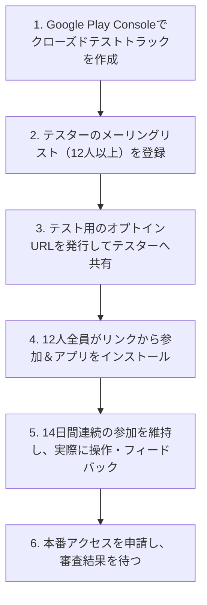

本番ビルドができても、それを受け入れる「ストアの開発者アカウント」がなければ世界中にアプリを届けることはできません。

このステップでは、**Apple Developer Program** と **Google Play Console** の登録手順、審査で必須となる法規関連（プライバシーポリシー等）の準備、そして個人開発者が最も頭を悩ませる「Google Playの12人テスター要件」の攻略法までを詳しく解説します。

---

## この記事のサブコンテンツ

1. [開発者アカウントの料金・必要書類・基本比較](#1-開発者アカウントの料金必要書類基本比較)
2. [Apple Developer Programの登録とApp Store Connectの初期設定](#2-apple-developer-programの登録とapp-store-connectの初期設定)
3. [Google Play Consoleの登録と本人確認（KYC）](#3-google-play-consoleの登録と本人確認kyc)
4. [Google Play「12人×14日間のクローズドテスト」完全攻略ロードマップ](#4-google-play12人14日間のクローズドテスト完全攻略ロードマップ)
5. [プライバシーポリシーの下書きと確認事項](#5-プライバシーポリシーの下書きと確認事項)
6. [まとめと次のステップ](#6-まとめと次のステップ)

---

## 1. 開発者アカウントの料金・必要書類・基本比較

| 項目 | Apple Developer Program | Google Play Console |
| :--- | :--- | :--- |
| **費用** | 年間 99米ドル（地域の通貨・税・申込方法により異なる） | 初回登録料 25米ドル（アカウント維持にはポリシー遵守が必要） |
| **本人確認** | Apple IDの2要素認証、クレジットカード | パスポートまたは運転免許証による厳格なKYC |
| **アカウント区分** | 個人名義（本名がストアに表示）または組織（DUNS番号要） | 個人名義（本名と住所が一部公開）または組織 |
| **承認までの日数** | 通常24時間〜数日 | 本人確認の審査に1〜3営業日 |

---

## 2. Apple Developer Programの登録とApp Store Connectの初期設定

### 登録手順
1. iPhoneの「Apple Developer」アプリをダウンロードして申請するのが最もスムーズです（Apple IDの生体認証と本人確認が端末上で完結するため）。
2. 年間契約（99ドル）をApple Payまたはクレジットカードで支払います。
3. 承認完了後、Webブラウザで **[App Store Connect](https://appstoreconnect.apple.com/)** にログインします。

### App Store Connectでの新規アプリ作成
- **マイApp** → **「＋（新規App）」** をクリック。
- **プラットフォーム**: iOS にチェック。
- **名前**: アプリ名（例: `HabitFlow`）
- **プライマリ言語**: 日本語
- **バンドルID**: `app.json` で指定した識別子（`com.yourname.habitflow`）を選択。
- **SKU**: 管理用の任意のユニーク文字列（例: `habitflow-001`）

---

## 3. Google Play Consoleの登録と本人確認（KYC）

### 登録手順
1. **[Google Play Console](https://play.google.com/console/)** にアクセスし、Googleアカウントでログインします。
2. アカウントタイプとして「個人」または「組織」を選択し、初回登録料（25ドル）を支払います。
3. 運転免許証やパスポートの鮮明な写真をアップロードし、本人確認（Identity Verification）を申請します（通常1〜3日で承認されます）。
4. クレジットカードまたはデビットカードの明細住所と、登録住所が完全に一致していることを確認してください。

---

## 4. Google Play「12人×14日間のクローズドテスト」完全攻略ロードマップ

2023年11月13日以降に作成された個人のGoogle Playアカウントでは、「**本番公開を申請する前に、最低12人のテスターがオプトインした状態で14日間連続でクローズドテストを実施する**」という必須要件が課されています（制度開始当初は20人でしたが、2024年12月に12人へ緩和されました）。

組織（ビジネス）アカウント、および2023年11月13日より前に作成された個人アカウントは対象外です。

人数と期間を満たすと本番アクセスを申請できますが、承認が保証されるわけではありません。実際の利用、集まったフィードバック、改善内容も申請で説明します。[Google Playのテスト要件](https://support.google.com/googleplay/android-developer/answer/14151465?hl=en-GB)を確認してください。



### テスターを集める具体的なアクション
- **開発者コミュニティやX（旧Twitter）の相互協力**: 「#GooglePlay12人テスター」などのハッシュタグで、お互いにアプリをインストールし合うコミュニティが活発に機能しています。
- **職場・家族・友人への直接依頼**: リアルな知人にお願いするのが最も確実です。
- **Phase05のテスター網の転用**: Firebase App Distributionで協力してくれたテスターに、Google Playの**クローズドテスト**への参加を依頼します。要件を満たせるのはクローズドテストのみで、内部テスト（内部テスト用トラック）での参加は14日間のカウント対象にならない点に注意してください。

---

## 5. プライバシーポリシーの下書きと確認事項

両ストアの公開要件に沿って、**ログイン不要で閲覧できるプライバシーポリシーのURL**を用意します。ストアの要件と、提供地域で適用される法令は分けて確認してください。

以下は下書きです。名前と連絡先だけを差し替えて公開しないでください。広告、Analytics、RevenueCat、Firebase認証、クラウド保存、AI連携を追加した場合は、取得・送信する情報と目的を実装に合わせて書き直します。

```markdown
# プライバシーポリシー

当プライバシーポリシーは、[あなたの名前/屋号]（以下「当方」）が提供するスマートフォン向けアプリケーション「[アプリ名]」（以下「本アプリ」）における利用者情報の取り扱いについて定めたものです。

## 1. 取得する情報および利用目的
[実際に取得・送信するデータ、利用目的、必須・任意の区別を記載]
- 習慣名・記録履歴: [端末内保存のみ／クラウド同期を行う範囲と目的]
- アカウント情報: [匿名UID、メールアドレス等の有無と利用目的]
- 利用状況・診断情報: [計測の有無、送信データ、停止方法]

## 2. 外部サービスへの送信
[採用しているサービスだけを記載し、各社のプライバシーポリシーへリンク]
- 広告: [AdMob等へ送信する情報と広告配信の目的]
- 購入: [ストア／RevenueCat等が扱う購入情報・識別子]
- AI: [送信する入力データ、提供先、利用目的、保存の扱い]

## 3. 保存期間・削除・利用者の選択
[保存期間、データ削除の方法、アカウント削除の窓口、同意の変更方法を記載]

## 4. お問い合わせ
本ポリシーに関するお問い合わせは、以下の連絡先までお願いいたします。
- 連絡先: [あなたの連絡用メールアドレス]
- 制定日: [YYYY年M月D日]
```

---

## 6. まとめと次のステップ

開発者アカウントが揃い、ストアにアプリを受け入れるための法規・管理基盤が整いました。

次の記事では、ユーザーが思わずインストールしたくなるような魅力的なアプリ説明文、キャッチコピー、そして美麗なストア用スクリーンショット画像をAIと対話しながら一気に作り上げる「[04. ストア掲載情報とスクリーンショットをAIで作成する](../04/)」に進みましょう。
