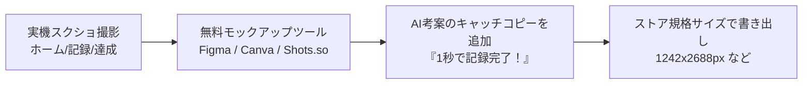

ストアでユーザーがあなたのアプリを見つけ、ダウンロードするかどうかを決める最大の要素は、「**タイトル・説明文（テキスト）**」と「**スクリーンショット（画像）**」です。

どんなに素晴らしい機能を作っても、ストアの見た目が地味だったり、説明文が不親切だったりすると、誰の目にも留まりません。

幸いなことに、バイブコーディングの時代には、魅力的なキャッチコピーの考案、ASO（App Store最適化）キーワードの抽出、そしてストア用スクリーンショットの構成案まで、すべてAIと一緒に短時間でプロフェッショナル級に仕上げることができます。

この記事では、ASOの基礎から、AIを使った掲載情報の生成プロンプト、そしてストア用スクリーンショット画像の作成手順までを詳しく解説します。

---

## この記事のサブコンテンツ

1. [ASO（App Store最適化）の基礎とキーワード選定戦略](#1-asoapp-store最適化の基礎とキーワード選定戦略)
2. [AIエージェントにストア掲載テキストを一括生成させるプロンプト](#2-aiエージェントにストア掲載テキストを一括生成させるプロンプト)
3. [App Store & Google Playのスクリーンショット規格一覧](#3-app-store--google-playのスクリーンショット規格一覧)
4. [実機画面からキャッチコピー付きモックアップ画像を作る実践手順](#4-実機画面からキャッチコピー付きモックアップ画像を作る実践手順)
5. [年齢制限レーティングとデータプライバシー質問票の回答ガイド](#5-年齢制限レーティングとデータプライバシー質問票の回答ガイド)
6. [まとめと次のステップ](#6-まとめと次のステップ)

---

## 1. ASO（App Store最適化）の基礎とキーワード選定戦略

ASO（App Store Optimization）とは、ストア内の検索結果で上位に表示され、検索ユーザーを効率的にインストールへと導くための最適化手法です。

- **タイトル（30文字以内）**: 最も検索アルゴリズムに影響します。「アプリ名 - コア機能キーワード」の組み合わせが鉄則です（例: `HabitFlow - 1秒で続く習慣トラッカー`）。
- **サブタイトル / 簡単な説明**: ユーザーが検索結果一覧でチラ見するキャッチコピー（例: `ログイン不要ですぐ記録。3日坊主を卒業する。`）。
- **キーワード（Apple専用・100バイト以内）**: 検索インデックス専用の隠しフィールド。アプリに関連する語を半角コンマで区切ります。語句内の必要なスペースは使えます。

---

## 2. AIエージェントにストア掲載テキストを一括生成させるプロンプト

`SPEC.md` のペルソナとコア機能を入力として、AIにストア掲載テキストを一括生成させます。

```text
【タスク: App Store & Google Play ストア掲載情報の作成】

ルートの `SPEC.md` を読み込んでください。
このアプリの魅力を最大限に伝え、ASO（検索順位）を高めるストア掲載テキストを作成してください。

### 出力項目:
1. アプリ名案（30文字以内、コアキーワードを含む）
2. サブタイトル案（30文字以内、ユーザーの感情を動かすキャッチコピー）
3. Apple用キーワード（UTF-8で100バイト以内、半角コンマ区切り。語句内の必要なスペースは可）
4. Google Play 簡単な説明（80文字以内）
5. 詳細な説明文（約1,500〜2,000文字）:
   - 冒頭のフック（こんな悩みはありませんか？）
   - HabitFlowの3つの特徴（なぜ続くのか）
   - 主な機能一覧（シンプルさの強調）
   - 開発者の想いとプライバシーへの配慮（安心感）
```

生成された文面をベースに、自分の言葉で微調整します。[App Store Connectの項目仕様](https://developer.apple.com/help/app-store-connect/reference/app-information/platform-version-information)ではキーワード上限が100バイトとされています。日本語は文字数とバイト数が異なるため、UTF-8のバイト数も検証し、管理画面で受け付けられることを確認してください。

---

## 3. App Store & Google Playのスクリーンショット規格一覧

スクリーンショットは、**必須の登録条件**と**推奨掲載枠の条件**を分けて確認します。以下は2026年9月8日に確認した仕様です。対象端末や提出時の管理画面に合わせて用意してください。

### App Store（App Store Connect）

| 枠 | 縦向き解像度の例 (px) | 条件 |
| :--- | :--- | :--- |
| **iPhone 6.9インチ** | **1260 × 2736 / 1290 × 2796 / 1320 × 2868** | iPhone向けの代表サイズ。対応する小さいサイズへ縮小利用される |
| **iPhone 6.5インチ** | **1242 × 2688 / 1284 × 2778** | iPhone対応で、6.9インチの画像を提供しない場合に必要 |
| **iPad 13インチ** | **2064 × 2752 / 2048 × 2732** | iPad対応アプリで必要 |

6.5インチと6.9インチの両方を必ず提出するわけではありません。iPadの必要性も、`ios.supportsTablet` などによる実際の対応端末で決まります。[Appleのスクリーンショット仕様](https://developer.apple.com/help/app-store-connect/reference/app-information/screenshot-specifications/)を最終確認してください。

### Google Play

通常のスマートフォン向けスクリーンショットの基本条件は、**最低2枚、端末種別ごとに最大8枚**、JPEGまたは透過なしの24-bit PNG、各辺320〜3840px、長辺が短辺の2倍以内です。

**すべての画像が16:9か9:16でなければ登録できない、という意味ではありません。** この比率は、推奨掲載や大画面向けなどの条件と区別する必要があります。大画面向けの案内には、4枚以上・各辺1080〜7680px・横16:9または縦9:16といった別の指定があります。

Android端末種別ごとに実際の表示を撮り、[Google Playのプレビューアセット仕様](https://support.google.com/googleplay/android-developer/answer/9866151?hl=ja)で該当する枠の条件を確認します。7インチ・10インチの画面が同じかどうかも実機やエミュレータで確かめ、単純な画像の使い回しを前提にしないでください。

:::tip[スクリーンショット以外の掲載素材も用意する]
Google Playでは、ストア用アイコン（512 × 512px）とフィーチャーグラフィック（1024 × 500px）も必要です。アプリのランチャーアイコンとは別の提出素材として管理します。
:::

必要な画像セット数は、対応OS・端末・言語によって変わります。先に提出先の一覧を作り、[PhaseEx：05](../../advanced/05/)の自動化でも同じ構成を使います。

---

## 4. 実機画面からキャッチコピー付きモックアップ画像を作る実践手順

生の画面スクリーンショットをそのまま貼るだけでは、ストアで目立ちません。「**スマホ端末の枠（モックアップフレーム） + 上部に太字のキャッチコピー**」を組み合わせたバナー風画像を作成します。



### おすすめのキャッチコピー構成（王道の4枚）
1. **1枚目**: アプリの最大の強み（例: `「続く」をデザインした、1秒習慣トラッカー`）
2. **2枚目**: メイン機能（例: `今日のタスクを、タップ1つで心地よく完了`）
3. **3枚目**: 振り返り・成果（例: `カレンダーと連続記録で、成長を実感`）
4. **4枚目**: 安心感（例: `ログイン不要。データはすべてあなたの手元に。`）

Figmaのコミュニティテンプレート（「App Store Screenshot Template」で検索）や、無料のモックアップ生成Webツール（Shots.soなど）を使うと、誰でも数分でプロ級の画像が完成します。

---

## 5. 年齢制限レーティングとデータプライバシー質問票の回答ガイド

管理画面で提出前に回答を求められる各種質問票の要点です。

- **年齢制限レーティング**:
  - 暴力表現、ギャンブル、成人向けコンテンツがない場合、通常は「4+（全年齢対象）」または「Everyone」になります。
- **データセーフティ（Google）/ Appのプライバシー（Apple）**:
  - 氏名やメールアドレスだけでなく、識別子・利用状況・診断情報・購入情報や、組み込んだSDKの送信内容まで確認します。
  - 「収集しない」はアプリと全SDKの実態が該当するときに選びます。AdMob、Analytics、RevenueCat、クラウド保存やAI連携の導入状況に合わせ、各ストアの定義とSDKの開示情報に沿って回答してください。

---

## 6. まとめと次のステップ

ストアのショーウィンドウが魅力的に飾り付けられました！

次の記事では、AdMob広告とアプリ内課金を実装し、その審査要件をクリアして、いよいよ審査提出ボタンを押して世界中にアプリを正式リリースする「[05. 広告と課金を実装し、審査を通してリリースする](../05/)」に進みましょう。
