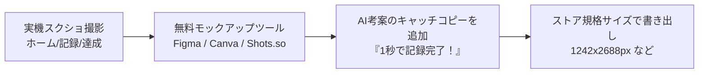

ストアでユーザーがあなたのアプリを見つけ、ダウンロードするかどうかを決める最大の要素は、「**タイトル・説明文（テキスト）**」と「**スクリーンショット（画像）**」です。

どんなに素晴らしい機能を作っても、ストアの見た目が地味だったり、説明文が不親切だったりすると、誰の目にも留まりません。

幸いなことに、バイブコーディングの時代には、魅力的なキャッチコピーの考案、ASO（App Store最適化）キーワードの抽出、そしてストア用スクリーンショットの構成案まで、すべてAIと一緒に短時間でプロフェッショナル級に仕上げることができます。

この記事では、ASOの基礎から、AIを使った掲載情報の生成プロンプト、そしてストア用スクリーンショット画像の作成手順までを詳しく解説します。

---

## この記事のサブコンテンツ

1. [ASO（App Store最適化）の基礎とキーワード選定戦略](#1-asoapp-store最適化の基礎とキーワード選定戦略)
2. [AIエージェントにストア掲載テキストを一括生成させるプロンプト](#2-aiエージェントにストア掲載テキストを一括生成させるプロンプト)
3. [App Store & Google Playのスクリーンショット規格一覧](#3-app-store--google-playのスクリーンショット規格一覧)
4. [実機画面からキャッチコピー付きモックアップ画像を作る実践手順](#4-実機画面からキャッチコピー付きモックアップ画像を作る実践手順)
5. [年齢制限レーティングとデータプライバシー質問票の回答ガイド](#5-年齢制限レーティングとデータプライバシー質問票の回答ガイド)
6. [まとめと次のステップ](#6-まとめと次のステップ)

---

## 1. ASO（App Store最適化）の基礎とキーワード選定戦略

ASO（App Store Optimization）とは、ストア内の検索結果で上位に表示され、検索ユーザーを効率的にインストールへと導くための最適化手法です。

- **タイトル（30文字以内）**: 最も検索アルゴリズムに影響します。「アプリ名 - コア機能キーワード」の組み合わせが鉄則です（例: `HabitFlow - 1秒で続く習慣トラッカー`）。
- **サブタイトル / 簡単な説明**: ユーザーが検索結果一覧でチラ見するキャッチコピー（例: `ログイン不要ですぐ記録。3日坊主を卒業する。`）。
- **キーワード（Apple専用・100文字）**: 検索インデックス専用の隠しフィールド。コンマ区切りで類語や関連語を詰め込みます（スペースは文字数を消費するので不要）。

---

## 2. AIエージェントにストア掲載テキストを一括生成させるプロンプト

`SPEC.md` のペルソナとコア機能を入力として、AIにストア掲載テキストを一括生成させます。

```text
【タスク: App Store & Google Play ストア掲載情報の作成】

ルートの `SPEC.md` を読み込んでください。
このアプリの魅力を最大限に伝え、ASO（検索順位）を高めるストア掲載テキストを作成してください。

### 出力項目:
1. アプリ名案（30文字以内、コアキーワードを含む）
2. サブタイトル案（30文字以内、ユーザーの感情を動かすキャッチコピー）
3. Apple用キーワード（100文字以内、半角コンマ区切り、スペースなし）
4. Google Play 簡単な説明（80文字以内）
5. 詳細な説明文（約1,500〜2,000文字）:
   - 冒頭のフック（こんな悩みはありませんか？）
   - HabitFlowの3つの特徴（なぜ続くのか）
   - 主な機能一覧（シンプルさの強調）
   - 開発者の想いとプライバシーへの配慮（安心感）
```

生成された文面をベースに、自分の言葉で微調整してストアの各入力欄に貼り付けます。

---

## 3. App Store & Google Playのスクリーンショット規格一覧

ストアに登録するスクリーンショットには厳格な解像度規定があり、**どちらのストアも規格外の画像はアップロードの時点で弾きます**。必要な枠は、スマホ1種類だけでは足りません。

### App Store（App Store Connect）

| 枠 | 解像度 (px) | 必須か |
| :--- | :--- | :--- |
| **iPhone 6.5インチ** | **1242 × 2688** または 1284 × 2778 | **必須。** これがないと提出できません |
| **iPad 13インチ** | **2064 × 2752** または 2048 × 2732 | **iPad対応で出すなら必須** |

App Storeは**対応している端末ファミリーごと**にスクリーンショットを要求します。`app.json` でiPadを対象から外していない限り、iPhoneだけでは提出できません。

### Google Play

| 枠 | 解像度 (px) | 必須か |
| :--- | :--- | :--- |
| **スマートフォン** | **1242 × 2208** など（9:16） | **必須。** 最低2枚、最大8枚 |
| **7インチタブレット** | **1980 × 3520** など（9:16） | タブレットに配信するなら必須 |
| **10インチタブレット** | 7インチと**同じ画像で構いません** | タブレットに配信するなら必須 |

7インチと10インチは規格が同じなので、**同じ画像を両方の枠にアップロードして問題ありません**。枠を分けて撮り分ける必要はありません。

:::caution[Playの縦横比は 16:9 か 9:16 のちょうど2択です]
Google Playのスクリーンショットは、**縦横比が 16:9 または 9:16 でなければ受け付けられません。**「だいたい縦長」では通らず、2:1に近い値でも弾かれます。

- 各辺は **320px 〜 3840px**
- 1枚あたり **8MB以下**、PNG または JPEG

**App Store用の画像はそのまま流用できません**。iPhone 6.5インチ枠（1242 × 2688）は約2.16:1、iPad 13インチ枠（2064 × 2752）は4:3で、どちらも9:16ではないからです。**Android用は別枠として用意してください。**
:::

つまり最低限、**iPhone 6.5インチ / iPad 13インチ / Androidスマホ / Androidタブレット の4サイズ**を、対応言語の数だけ作ることになります。日英2言語なら8セットです。ここが手作業だと一番つらい部分なので、後述の[PhaseEx：05](../../advanced/05/)ではこのアップロードを自動化する方法も扱っています。

---

## 4. 実機画面からキャッチコピー付きモックアップ画像を作る実践手順

生の画面スクリーンショットをそのまま貼るだけでは、ストアで目立ちません。「**スマホ端末の枠（モックアップフレーム） + 上部に太字のキャッチコピー**」を組み合わせたバナー風画像を作成します。



### おすすめのキャッチコピー構成（王道の4枚）
1. **1枚目**: アプリの最大の強み（例: `「続く」をデザインした、1秒習慣トラッカー`）
2. **2枚目**: メイン機能（例: `今日のタスクを、タップ1つで心地よく完了`）
3. **3枚目**: 振り返り・成果（例: `カレンダーと連続記録で、成長を実感`）
4. **4枚目**: 安心感（例: `ログイン不要。データはすべてあなたの手元に。`）

Figmaのコミュニティテンプレート（「App Store Screenshot Template」で検索）や、無料のモックアップ生成Webツール（Shots.soなど）を使うと、誰でも数分でプロ級の画像が完成します。

---

## 5. 年齢制限レーティングとデータプライバシー質問票の回答ガイド

管理画面で提出前に回答を求められる各種質問票の要点です。

- **年齢制限レーティング**:
  - 暴力表現、ギャンブル、成人向けコンテンツがない場合、通常は「4+（全年齢対象）」または「Everyone」になります。
- **データセーフティ（Google）/ Appのプライバシー（Apple）**:
  - 個人情報を収集しない場合: 「本アプリはユーザーデータを収集・共有しません」を選択。
  - AdMob広告を導入している場合: 「サードパーティ広告の目的でデバイスIDや利用状況データを収集します」を選択。

---

## 6. まとめと次のステップ

ストアのショーウィンドウが魅力的に飾り付けられました！

次の記事では、AdMob広告とアプリ内課金を実装し、その審査要件をクリアして、いよいよ審査提出ボタンを押して世界中にアプリを正式リリースする「[05. 広告と課金を実装し、審査を通してリリースする](../05/)」に進みましょう。
