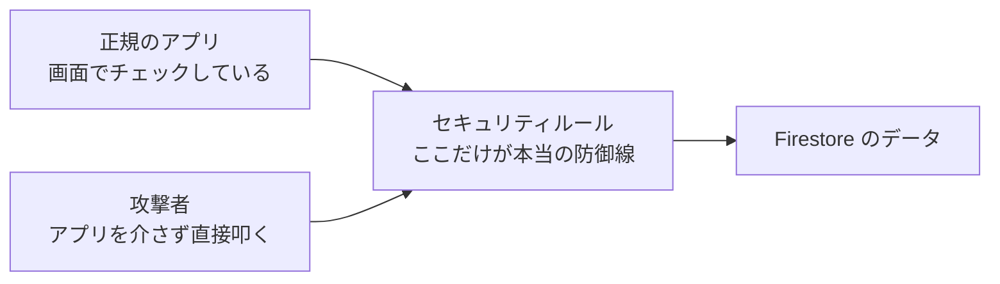

セキュリティ編の最終章です。

前の記事で、Firebaseの `apiKey` のような公開キーは「アプリに入れてよい」と書きました。ただしそれには条件がありました。**その裏側で、権限が正しく絞られていること**です。

この最後の砦が抜けていると、キーを拾った誰でもあなたのデータベースを読み書きできます。しかも、アプリの画面は何事もなく正常に動くため、**自分では絶対に気づけません**。

---

## この記事のサブコンテンツ

1. [セキュリティルールが唯一の防御線である理由](#1-セキュリティルールが唯一の防御線である理由)
2. [絶対に本番へ出してはいけないルール](#2-絶対に本番へ出してはいけないルール)
3. [Firestoreの基本ルールを書く](#3-firestoreの基本ルールを書く)
4. [Cloud Storageと Cloud Functions の権限](#4-cloud-storageと-cloud-functions-の権限)
5. [ルールをテストして確かめる](#5-ルールをテストして確かめる)
6. [認証まわりで見落としやすい点](#6-認証まわりで見落としやすい点)
7. [公開前の最終セキュリティチェックリスト](#7-公開前の最終セキュリティチェックリスト)
8. [VibeCode Mobile 全編の総まとめ](#8-vibecode-mobile-全編の総まとめ)

---

## 1. セキュリティルールが唯一の防御線である理由

Firebaseのようなサービスでは、アプリがデータベースを**直接**呼びます。間にあなたのサーバーは挟まりません。

つまり、アプリ側のコードで `if (user.id === habit.ownerId)` のようなチェックを書いても、**それは防御になりません**。攻撃者はアプリを使わず、SDKやHTTPで直接データベースを叩けるからです。



**アプリ側のチェックはUXのため、セキュリティルールは防御のため。** この2つは役割がまったく違います。

---

## 2. 絶対に本番へ出してはいけないルール

Firebaseコンソールでデータベースを作ると、開発しやすいように緩いルールが初期設定されます。これをそのまま公開してしまう事故が、いちばん多いパターンです。

### 危険なルール①：全開放

```javascript
// 絶対にダメ。世界中の誰でも読み書きできる
match /{document=**} {
  allow read, write: if true;
}
```

### 危険なルール②：ログインしていれば何でもできる

```javascript
// これもダメ。他人のアカウントでログインすれば全員のデータが見える
match /{document=**} {
  allow read, write: if request.auth != null;
}
```

**匿名認証を使っている場合、これは実質的に全開放と同じです。** 誰でも一瞬で匿名アカウントを作れるからです。

### 危険なルール③：期限切れのテストモード

```javascript
// 「30日間だけ全開放」。期限が切れると今度はアプリが全く動かなくなる
allow read, write: if request.time < timestamp.date(2026, 10, 1);
```

テストモードのまま公開すると、**期限内は全開放、期限後は全停止**という最悪の二段構えになります。

---

## 3. Firestoreの基本ルールを書く

応用事項編で採用した `users/{userId}/habits/{habitId}` という構造に対する、最小限のルールがこちらです。

```javascript
rules_version = '2';
service cloud.firestore {
  match /databases/{database}/documents {

    // 自分のデータだけを読み書きできる
    match /users/{userId}/{document=**} {
      allow read, write: if request.auth != null
                         && request.auth.uid == userId;
    }

    // 上のどれにも当てはまらないものは、すべて拒否する
    match /{document=**} {
      allow read, write: if false;
    }
  }
}
```

### ここで押さえるべき2点

**① 最後に全拒否を置く**
Firestoreのルールは「許可されていないものは拒否」が既定ですが、明示的に書いておくと、あとからコレクションを足したときに**うっかり無防備なまま公開する事故**を防げます。

**② `request.auth.uid == userId` が本体**
「ログインしているか」ではなく「**本人か**」を見るのが要点です。前者だけでは防御になりません。

### 書き込む内容まで検証する

さらに厳しくするなら、書き込まれるデータの形も検証できます。

```javascript
match /users/{userId}/habits/{habitId} {
  allow read: if request.auth != null && request.auth.uid == userId;

  allow create: if request.auth != null
                && request.auth.uid == userId
                && request.resource.data.title is string
                && request.resource.data.title.size() > 0
                && request.resource.data.title.size() <= 100;

  allow update, delete: if request.auth != null
                        && request.auth.uid == userId;
}
```

これで、空文字や極端に長い文字列がデータベースに入ることを、**サーバー側で**防げます。アプリ側のバリデーションは迂回できますが、こちらは迂回できません。

---

## 4. Cloud Storageと Cloud Functions の権限

### Cloud Storage

画像アップロードを実装した場合、Storageにも同じ考え方でルールが要ります。**Firestoreのルールを書いてStorageを忘れる**のは、よくある抜けです。

```javascript
rules_version = '2';
service firebase.storage {
  match /b/{bucket}/o {
    match /users/{userId}/{allPaths=**} {
      allow read: if request.auth != null && request.auth.uid == userId;
      allow write: if request.auth != null
                   && request.auth.uid == userId
                   && request.resource.size < 5 * 1024 * 1024
                   && request.resource.contentType.matches('image/.*');
    }
  }
}
```

サイズとContent-Typeの制限を入れておかないと、**ストレージを無料の巨大なファイル置き場として使われる**リスクがあります。

### Cloud Functions

応用事項編で作った `onCall` の関数では、必ず認証チェックを入れます。

```typescript
export const generateCoachAdvice = onCall(async (request) => {
  if (!request.auth) {
    throw new HttpsError('unauthenticated', 'ログインが必要です。');
  }
  // ...
});
```

さらに、AIのAPIを呼ぶ関数のように**呼ばれるたびに課金が発生する**ものは、認証だけでは不十分です。1ユーザーあたりの呼び出し回数に上限を設けるか、Firebase App Check を有効にして、正規のアプリ以外からのリクエストを弾いてください。

---

## 5. ルールをテストして確かめる

ルールは書いただけでは信用できません。**必ず動かして確かめてください。**

### Firebase コンソールのルールプレイグラウンド

Firestore の「ルール」タブにある **Rules Playground** で、「このユーザーがこのパスを読めるか」をその場で試せます。最低限、次の2つは試してください。

- **ユーザーAとしてログインし、ユーザーAのデータを読む** → 許可されるべき
- **ユーザーAとしてログインし、ユーザーBのデータを読む** → **拒否されるべき**

2つ目が通ってしまったら、そのルールは壊れています。

### エミュレータで自動テストする

```bash
firebase emulators:start --only firestore
```

ルールの自動テストを書いておけば、あとからルールを変更したときに、**うっかり穴を開けたことに気づけます**。

AIに書かせる場合は、こう頼みます。

```text
【タスク: Firestoreセキュリティルールのテスト作成】

以下の `firestore.rules` に対して、`@firebase/rules-unit-testing` を使った
テストコードを作成してください。

### 必ず含めてほしいテストケース
1. 未ログインのユーザーが、任意のデータを読めないこと。
2. ログイン済みユーザーが、自分のデータを読み書きできること。
3. ログイン済みユーザーが、他人のデータを読めないこと。
4. ログイン済みユーザーが、他人のデータを書き換えられないこと。
5. ルールに定義されていないコレクションへのアクセスが拒否されること。

「拒否されるべきケース」を必ず含めてください。
許可されるケースだけのテストは、穴を見つけられません。

### 対象ルール
[ここに firestore.rules の内容を貼り付ける]
```

---

## 6. 認証まわりで見落としやすい点

- **匿名認証を「認証済み」として扱わない**：匿名ユーザーは誰でも作れます。課金や重要データの判定に使わないでください。
- **メール確認を必須にする**：メールアドレスでログインさせる場合、`request.auth.token.email_verified == true` をルールに入れると、なりすまし登録を弾けます。
- **ログアウト時にローカルデータを消す**：端末を共有している場合、AsyncStorageに前のユーザーのデータが残ることがあります。
- **アカウント削除の導線を用意する**：ストアのポリシー上、アカウント作成機能があるアプリには**アカウント削除の手段が必要**です。App Store では審査で指摘されます。
- **有効なプロバイダだけを有効にする**：Firebase Authenticationの管理画面で、使っていないログイン方法は無効にしておきます。

---

## 7. 公開前の最終セキュリティチェックリスト

### データベース・ストレージ
- [ ] `allow read, write: if true;` がどこにも残っていない
- [ ] テストモードの日付ベースのルールが残っていない
- [ ] 「ログイン済みか」ではなく「本人か」で判定している
- [ ] ルールの末尾に全拒否のフォールバックがある
- [ ] Cloud Storage にもルールを書いた（サイズとContent-Typeの制限を含む）
- [ ] Rules Playground で「他人のデータが読めないこと」を確認した

### 認証
- [ ] 匿名ユーザーを重要な判定に使っていない
- [ ] アカウント削除の導線がアプリ内にある
- [ ] 使っていない認証プロバイダを無効にした

### サーバー・課金
- [ ] Cloud Functions の入口で認証チェックをしている
- [ ] 課金の発生する関数に、呼び出し回数の上限か App Check がある

### 秘密情報（前記事の再掲）
- [ ] コードとGit履歴に秘密情報が無い
- [ ] `EXPO_PUBLIC_` の値はすべて「公開されてよい」と判断済み

---

## 8. VibeCode Mobile 全編の総まとめ

おめでとうございます。これで「VibeCode Mobile」の**全8フェーズ・全40記事**を完走しました。

- **Phase01：準備編** で、開発ツールやAIサブスクを選び、開発環境を立ち上げました。
- **Phase02：リサーチ編** で、Google Deep Researchと対話して市場を調べ、MVP要件（`SPEC.md`）を定義しました。
- **Phase03：リデザイン編** で、Google Stitchを活用して美しいUI仕様（`DESIGN.md`）を固めました。
- **Phase04：コーディング編** で、GitHub Spec Kit の仕様駆動サイクルを回して本物の動くMVPアプリを組み上げました。
- **Phase05：フィードバック編** で、EAS BuildとFirebase App Distributionでテスターへ届け、改善サイクルを回しました。
- **Phase06：公開＆マネタイズ編** で、ストア審査を突破し、全世界へリリースして収益化の扉を開きました。
- **PhaseEx：応用事項編** で、Firebase連携・Push通知・Gemini AI・GA4での計測・ストア反映の自動化という本格プロダクション技術を身につけました。
- **PhaseSec：セキュリティ編**（この編）で、公開したアプリとユーザーのデータを守る観点を身につけました。

### 速さと責任は両立します

バイブコーディングの本質は、**「作る速さ」を手に入れること**です。そして、速く作れるようになったからこそ、最後にこのセキュリティ編を置きました。

アイデアを思いついたその日のうちにAIと企画を深掘りし、週末にはプロトタイプを動かし、翌月にはストアで世界中の誰かの日常を少しだけ便利にする。その速さは、**ユーザーのデータを預かる責任とセットで**初めて意味を持ちます。

幸い、この記事で扱った内容はどれも、慣れてしまえば数十分で終わる作業です。速く作り、きちんと守る。その両方ができる個人開発者は、決して多くありません。

さあ、次はあなたが世界を驚かせるアプリを作る番です。楽しんでコードとバイブスを紡いでいってください！
